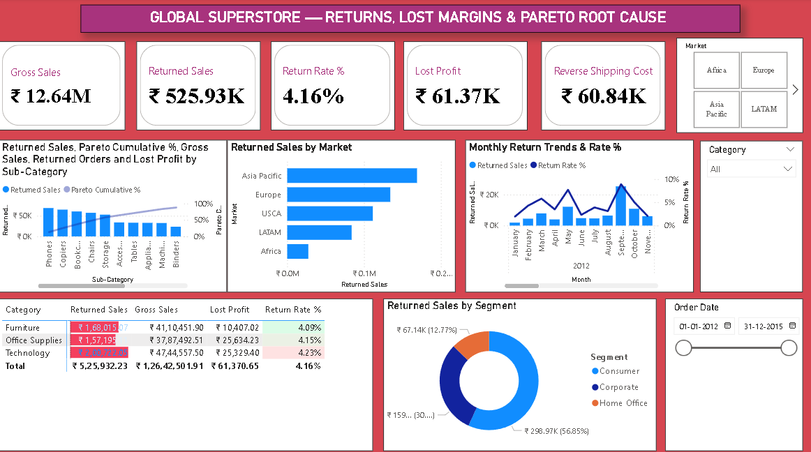

# 📦 Day 10: Global Superstore — Returns, Lost Margins & Pareto (80/20) Root Cause Analytics



## 📌 Executive Overview
This commercial returns dashboard analyzes product return dynamics, reverse logistics sunk costs, and net margin degradation across **51,290 order items (25,728 distinct orders)** from the Global Superstore dataset (2012–2015). It incorporates dynamic Pareto (80/20) cumulative loss modeling to isolate high-risk product sub-categories, customer segments, and global geographic markets.

---

## 🔑 Key Returns & Financial KPIs
* **Total Processed Orders:** 25,728 Orders (51,290 Order Line Items)
* **Gross Sales Revenue:** $12.64M ($12,642,501.91)
* **Returned Order Volume:** 1,079 Orders (2,220 Returned Line Items)
* **Macro Order Return Rate:** 4.19%
* **Returned Sales (Lost Revenue):** $525.93K (4.16% of Gross Sales)
* **Net Realized Sales:** $12.12M ($12,116,569.68)
* **Lost Gross Profit:** $61.37K ($61,370.65 forfeited margin)
* **Reverse Logistics Sunk Cost:** $60.84K ($60,842.60 in wasted freight)
* **Net Realized Profit:** $1.41M ($1,406,086.64)

---

## 🛠️ Data Architecture & ETL
* **Fact Table:** `Orders` (51,290 records across 24 commercial dimensions).
* **Dimension Table:** `Returns` (1,079 returned order IDs).
* **Power Query Merge:** Performed a Left Outer Join between `Orders[Order ID]` and `Returns[Order ID]`, expanding a clean binary flag (`Returned = "Yes" / "No"`) to optimize query evaluation speed and eliminate circular cross-filtering overhead.

---

## 📐 Core DAX Measures

### 1. Gross vs. Returned vs. Net Sales
```dax
Gross Sales = SUM(Orders[Sales])
```
```dax
Returned Sales = 
CALCULATE(
    [Gross Sales], 
    Orders[Returned] = "Yes"
)
```
```dax
Net Sales = [Gross Sales] - [Returned Sales]
```

### 2. Return Rate % (Sales Volume Ratio)
```dax
Return Rate % = 
DIVIDE([Returned Sales], [Gross Sales], 0)
```

### 3. Financial Margin Leakage & Logistics Losses
```dax
Lost Profit = 
CALCULATE(
    SUM(Orders[Profit]), 
    Orders[Returned] = "Yes"
)
```
```dax
Reverse Shipping Cost = 
CALCULATE(
    SUM(Orders[Shipping Cost]), 
    Orders[Returned] = "Yes"
)
```

### 4. Dynamic Pareto (80/20) Cumulative Loss Engine
```dax
Total Returned Sales (All SubCat) = 
CALCULATE(
    [Returned Sales], 
    ALLSELECTED(Orders[Sub-Category])
)
```

```dax
Pareto Cumulative % = 
VAR CurrentReturnedSales = [Returned Sales]
VAR CumulativeSum = 
    SUMX(
        FILTER(
            ALLSELECTED(Orders[Sub-Category]),
            [Returned Sales] >= CurrentReturnedSales
        ),
        [Returned Sales]
    )
RETURN 
DIVIDE(CumulativeSum, [Total Returned Sales (All SubCat)], 0)
```
* **Engine Concept:** Dynamically sorts and ranks sub-categories by return loss descending, computing running cumulative percentages across active filter contexts to identify the critical 20% SKU drivers causing 80% of return losses.

---

## 💡 Key Business Findings & Root Causes
1. **Pareto 80/20 Concentration:** The top **5 sub-categories** (**Phones**, **Copiers**, **Bookcases**, **Chairs**, and **Storage**) account for **$305.3K (58.0%)** of total return revenue losses. Prioritizing packaging quality and specification accuracy for these 5 lines will address the majority of return value leakage.
2. **Category Margin Degradation:** **Technology** suffered the highest monetary return loss (**$200.7K**, 4.23% return rate), followed by **Furniture** (**$168.0K**, 4.09% return rate) and **Office Supplies** (**$157.2K**, 4.15% return rate).
3. **Geographic Distribution:** **Asia Pacific** led total return volume (**$168.96K** across 307 returned orders), while **USCA** recorded the highest regional return rate (**4.71% of sales**).
4. **Logistics Double-Hit:** Returned inventory incurred **$60.84K** in reverse shipping costs on top of **$61.37K** in lost gross profits, compounding the true financial cost of returns beyond item value alone.

---

## 📂 Repository Contents
* `Global Superstore.xlsx` — Multi-market transactional retail dataset.
* `Global_Superstore_Returns_Pareto.pbix` — Interactive Power BI workbook.
* `dashboard_preview.png` — Dashboard screenshot preview.
* `README.md` — Project documentation and DAX specifications.