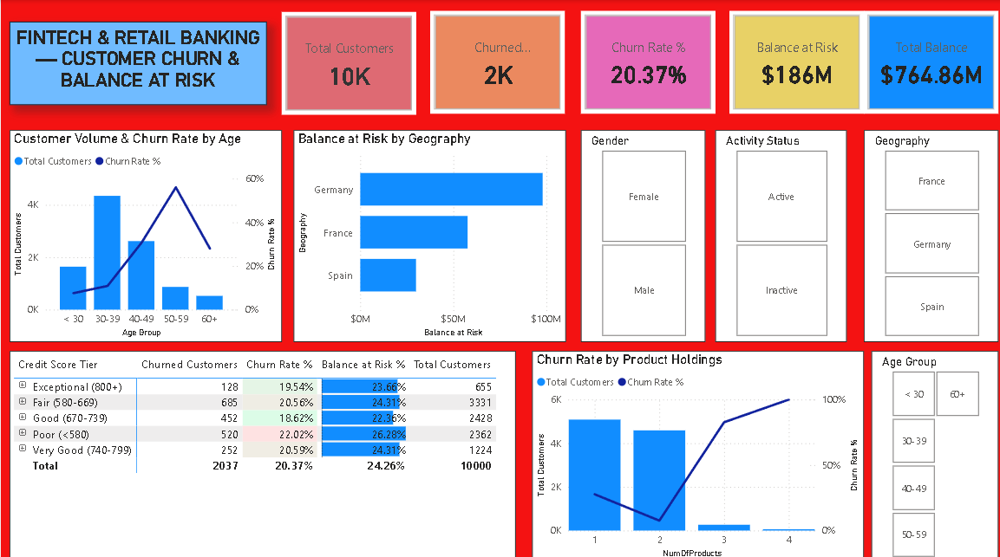

# 🏦 Day 11: Retail Banking & FinTech — Customer Churn, Risk Scoring & Capital Exposure Analytics



## 📌 Executive Overview
This portfolio risk dashboard analyzes customer retention patterns, capital flight, and behavioral attrition drivers across **10,000 retail banking customers** with **$764.86M in total managed deposits**. It investigates the demographic, credit, and product-engagement factors driving a baseline **20.37% churn rate**, identifying **$185.59M in lost deposit liquidity**.

---

## 🔑 Key Banking & Portfolio Risk Metrics
* **Total Customer Base:** 10,000 Account Holders
* **Retained Customer Base:** 7,963 Customers (79.63%)
* **Churned Account Holders:** 2,037 Customers (20.37% Attrition Rate)
* **Total Assets Under Management (AUM):** $764.86M ($764,858,892.88)
* **Balance at Risk (Lost Liquidity):** $185.59M (24.26% of Total Portfolio Deposits)
* **Average Customer Deposit Balance:** $76,485.89
* **Average Credit Score:** 650.5 (Fair / Good)
* **Active vs. Inactive Member Churn Spread:** 14.27% (Active) vs. 26.85% (Inactive)

---

## 🛠️ Data Architecture & Feature Engineering
* **Dataset:** 10,000 rows across 14 financial and behavioral dimensions.
* **Engineered Attributes:**
  * `Age Group`: Segmented into `< 30`, `30-39`, `40-49`, `50-59`, and `60+`.
  * `Credit Score Tier`: Standard FICO tiers (`Poor <580`, `Fair 580-669`, `Good 670-739`, `Very Good 740-799`, `Exceptional 800+`).
  * `Activity Status`: Binary transformation of `IsActiveMember` (`Active` / `Inactive`).

---

## 📐 Core DAX Measures

### 1. Account Churn Rate %
```dax
Churned Customers = 
CALCULATE(
    COUNTROWS(Churn_Modelling), 
    Churn_Modelling[Exited] = 1
)
```
```dax
Churn Rate % = 
DIVIDE([Churned Customers], [Total Customers], 0)
```

### 2. Capital at Risk & Liquidity Exposure
```dax
Balance at Risk = 
CALCULATE(
    SUM(Churn_Modelling[Balance]), 
    Churn_Modelling[Exited] = 1
)
```
```dax
Balance at Risk % = 
DIVIDE([Balance at Risk], [Total Balance], 0)
```

---

## 💡 Key Risk Findings & Strategic Takeaways
1. **The German Market Outlier:** Germany exhibits a **32.44% churn rate** resulting in **$97.97M in lost deposits**—more than France ($57.67M) and Spain ($29.95M) combined.
2. **Product Holding Paradox:** Customers with **2 products** demonstrate the lowest attrition (**7.58%**). Customers with 1 product churn at **27.71%**, while those with 3 or 4 products surge to **82.71%** and **100.00%**, highlighting operational issues in multi-product bundling.
3. **Generational Vulnerability:** The **50–59 age bracket** experienced a **56.21% churn rate**, representing a severe attrition point among prime-wealth depositors.
4. **Member Disengagement:** Inactive account holders churn at nearly double the rate (**26.85%**) of active users (**14.27%**).

---

## 📂 Repository Contents
* `Churn_Modelling.csv` — Raw banking portfolio dataset.
* `Bank_Customer_Churn_Analytics.pbix` — Interactive Power BI dashboard.
* `dashboard_preview.png` — Dashboard screenshot preview.
* `README.md` — Technical and financial documentation.