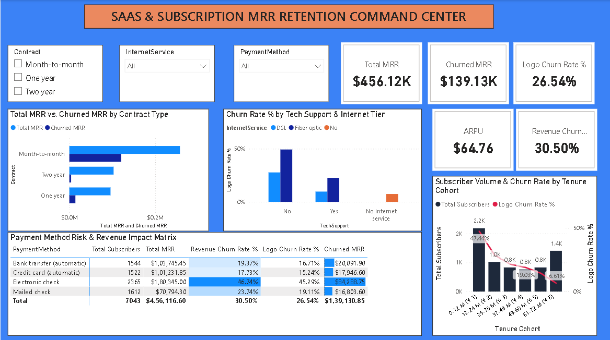

# 📈 Day 12: SaaS & Subscription Analytics — MRR, Revenue Retention & Cohort Attrition Dynamics



## 📌 Executive Overview
This SaaS and recurring revenue command center analyzes subscription lifecycle dynamics, contract commitments, and cash-flow attrition across **7,043 recurring accounts** managing **$456.12K in monthly recurring revenue (MRR)**. It decouples account attrition (Logo Churn) from capital attrition (Revenue Churn), isolating the operational, technical, and payment friction points driving **$139.13K in lost monthly recurring cash flow**.

---

## 🔑 Key Subscription & MRR Metrics
* **Total Active Subscribers:** 7,043 Accounts
* **Retained Subscribers:** 5,174 Accounts (73.46%)
* **Churned Accounts:** 1,869 Accounts
* **Logo Churn Rate %:** 26.54%
* **Total Monthly Recurring Revenue (MRR):** $456.12K ($456,116.60 / mo)
* **Churned MRR (Lost Monthly Run-Rate):** $139.13K ($139,130.85 / mo)
* **Annualized Run-Rate at Risk (ARR Loss):** $1.67M / year
* **Revenue Churn Rate %:** 30.50%
* **Average Revenue Per User (ARPU):** $64.76 / mo
* **Cumulative Lifetime Realized Billings:** $16.06M ($16,056,168.70)

---

## 🛠️ Data Architecture & Power Query ETL
* **Source:** 7,043 subscription accounts across 21 product, billing, and demographic dimensions.
* **ETL Transformation:** Handled 11 blank text entries (`" "`) in `TotalCharges` for zero-tenure new subscribers using `Replace Errors` $\rightarrow$ `0.00`, converting the field into a strict Decimal Number.
* **Feature Engineering:**
  * `Tenure Cohort`: Segmented customer lifecycles into 12-month tranches (`0-12 M (Yr 1)` through `61-72 M (Yr 6)`), paired with a numerical sort index.
  * `Senior Citizen Label`: Transformed binary flags into readable dimensions.

---

## 📐 Core DAX Formulations

### 1. Logo Churn vs. Revenue Churn Mechanics
```dax
Logo Churn Rate % = 
DIVIDE([Churned Subscribers], [Total Subscribers], 0)
```
```dax
Revenue Churn Rate % = 
DIVIDE([Churned MRR], [Total MRR], 0)
```
* **Analytical Takeaway:** Revenue Churn (**30.50%**) exceeds Logo Churn (**26.54%**), confirming that churn is skewed toward high-ARPU tiers.

### 2. Contracted MRR Baseline & Cash Flow Drain
```dax
Total MRR = SUM(Subscriptions[MonthlyCharges])
```
```dax
Churned MRR = 
CALCULATE(
    [Total MRR], 
    Subscriptions[Churn] = "Yes"
)
```

---

## 💡 Key Business Findings & Strategic Recommendations
1. **The First-Year Cliff:** Month 0–12 subscribers suffer a **47.44% churn rate** ($68.95K lost MRR), while Year 6 subscribers churn at just **6.61%**. Prioritize onboarding milestones during the first 90 days.
2. **Contract Architecture:** Month-to-month contracts exhibit an acute **42.71% churn rate** ($120.85K MRR lost). One-year (11.27%) and two-year (2.83%) contracts stabilize retention; incentivize annual upfront commitments.
3. **Service Tier Risk:** Fiber Optic accounts churn at **41.89%** ($114.30K MRR lost). Customers lacking Tech Support churn at **41.6%**, while adding Tech Support drops churn to **15.2%**. Bundle Tech Support into premium broadband tiers.
4. **Payment Friction:** Electronic check accounts experience **45.29% churn** ($84.29K lost MRR). Automating billing via credit card or ACH cuts churn to ~15%.

---

## 📂 Repository Contents
* `WA_Fn-UseC_-Telco-Customer-Churn.csv` — Raw subscription dataset.
* `SaaS_Subscription_MRR_Retention.pbix` — Power BI report workbook.
* `dashboard_preview.png` — Dashboard screenshot preview.
* `README.md` — Complete documentation and DAX specifications.