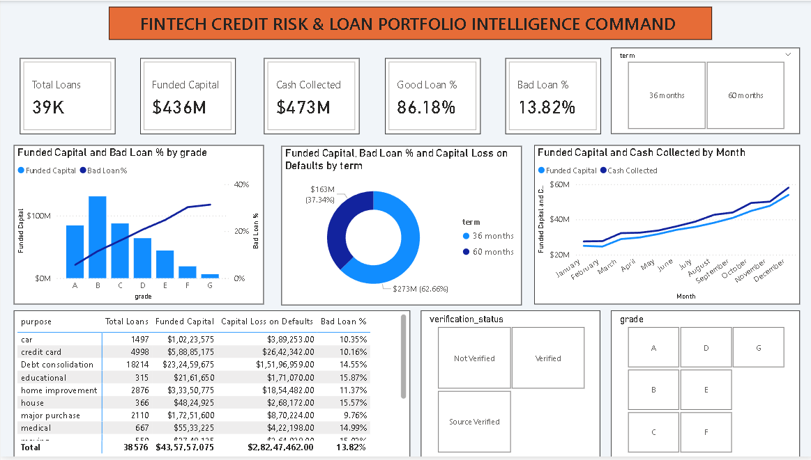

# 💳 Day 13: FinTech & Banking — Credit Risk, Loan Portfolio & Default Underwriting Analytics



## 📌 Executive Overview
This credit risk and underwriting intelligence command center evaluates portfolio origination quality, capital recovery yield, and charge-off exposure across **38,576 retail loan facilities** representing **$435.76M in total funded commitments**. It benchmarks performing assets against default write-offs, isolating term durations, borrower debt loads (DTI), and credit grades that drive **$28.25M in net capital loss**.

---

## 🔑 Portfolio Risk & Capital Recovery KPIs
* **Total Loan Applications:** 38,576 Originations
* **Total Funded Loan Book:** $435.76M ($435,757,075.00)
* **Total Cash Collections / Received:** $473.07M ($473,070,933.00)
* **Portfolio Net Cash Surplus:** +$37.31M over deployed principal
* **Good Loan Applications (Performing):** 33,243 Loans (86.18%)
* **Good Loan Funded Capital:** $370.22M (Yielding $435.79M in repayments)
* **Bad Loan Applications (Charged Off):** 5,333 Loans (13.82% Default Rate)
* **Bad Loan Funded Capital:** $65.53M ($65,532,225.00)
* **Net Capital Write-Off on Defaults:** $28.25M ($28,247,462.00)
* **Portfolio Average Interest Rate:** 12.05%
* **Portfolio Average DTI:** 13.33%

---

## 🛠️ Data Architecture & Power Query Modeling
* **Data Source:** `financial_loan.xlsx` (38,576 observations across 24 financial, underwriting, and borrower dimensions).
* **Data Hygiene:** 
  * Explicitly typed identifiers (`id`, `member_id`) as text to prevent arithmetic summation.
  * Formatted issue and settlement dates to strict calendar types (`Date`).
  * Engineered a conditional column `Loan Health` (`Bad Loan` for Charged Off, `Good Loan` for Fully Paid/Current).

---

## 📐 Core Underwriting DAX Formulations

### 1. Good vs. Bad Loan Bifurcation
```dax
Good Loan Applications = 
CALCULATE(
    [Total Loan Applications], 
    Loans[loan_status] IN {"Fully Paid", "Current"}
)
```
```dax
Bad Loan % = 
DIVIDE(
    CALCULATE([Total Loan Applications], Loans[loan_status] = "Charged Off"),
    [Total Loan Applications],
    0
)
```

### 2. Net Principal Capital Write-Off
```dax
Capital Loss on Defaults = 
VAR BadFunded = CALCULATE(SUM(Loans[loan_amount]), Loans[loan_status] = "Charged Off")
VAR BadReceived = CALCULATE(SUM(Loans[total_payment]), Loans[loan_status] = "Charged Off")
RETURN
    BadFunded - BadReceived
```

---

## 💡 Key Risk Findings & Underwriting Takeaways
1. **Loan Term Duration Risk:** 60-month loans exhibit a **22.34% default rate** ($36.37M bad loan funded), compared to **10.71%** for 36-month contracts.
2. **Underwriting Grade Attrition:** Default rates scale from **5.70% in Grade A** to **20.69% in Grade D**, peaking at **31.31% in Grade G**. High interest premiums (21.40%) on Grade G accounts fail to offset the 1-in-3 default frequency.
3. **Sector Vulnerability:** Borrowers citing `Small Business` as loan purpose experience a **25.62% default rate**, whereas `Credit Card` refinancing remains resilient at **10.16%**.

---

## 📂 Repository Contents
* `financial_loan.xlsx` — Raw loan portfolio dataset.
* `FinTech_Credit_Risk_Analytics.pbix` — Interactive Power BI analytical workbook.
* `dashboard_preview.png` — High-resolution dashboard screenshot.
* `README.md` — Project documentation and metrics glossary.