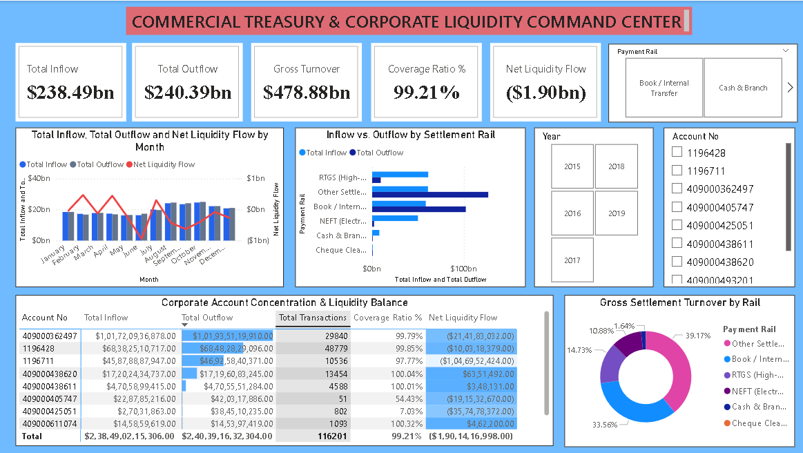

# 🏛️ Day 14: Commercial Treasury & Corporate Banking Liquidity Flow Analytics



## 📌 Executive Overview
This institutional treasury command center analyzes corporate liquidity flows, payment settlement rail concentration, and cash velocity across **116,201 institutional clearing transactions** totaling **$478.88B in gross turnover**. It monitors intraday liquidity reserves, settlement rail exposure (RTGS, NEFT, and Book Transfers), and account concentration risks across enterprise accounts managing a **-$1.90B net liquidity variance**.

---

## 🔑 Key Treasury & Liquidity KPIs
* **Gross Cash Turnover (Velocity):** $478.88B ($478,881,847,608)
* **Total Inflow Capital (Deposits):** $238.49B (62,652 deposit operations)
* **Total Outflow Capital (Disbursements):** $240.39B (53,549 withdrawal operations)
* **Net Liquidity Position:** -$1.90B (-$1,901,416,961 net liquidity drain)
* **Inflow Coverage Ratio:** 99.21%
* **Total Transaction Volume:** 116,201 transactions
* **Account Concentration:** Top 2 accounts generate 67.6% of total transaction volume ($338B+ turnover)

---

## 🛠️ Data Architecture & Power Query Transformation
* **Source:** 116,201 enterprise banking transactions across 9 operational fields.
* **ETL Pipeline:**
  * Cleaned account string artifacts (stripped single-quote delimiters).
  * Removed empty worksheets (`Sheet2`) and non-informative dummy columns.
  * Replaced transaction nulls with `0.00` for withdrawal and deposit vectors.
  * Classified unstructured settlement narrations into standard clearing rails: `RTGS (High-Value)`, `NEFT (Electronic)`, `Book / Internal Transfer`, `Cheque Clearing`, and `Cash & Branch`.

---

## 📐 Core Liquidity DAX Formulations

### 1. Gross Cash Velocity & Turnover
```dax
Gross Cash Turnover = [Total Inflow] + [Total Outflow]
```

### 2. Net Liquidity Position
```dax
Net Liquidity Flow = [Total Inflow] - [Total Outflow]
```

### 3. Inflow Coverage Ratio %
```dax
Inflow Coverage Ratio % = 
DIVIDE([Total Inflow], [Total Outflow], 0)
```

---

## 💡 Strategic Treasury Insights & Liquidity Management
1. **Capital Deficit Management:** Inflows ($238.49B) trailed total disbursements ($240.39B), creating an aggregate **-$1.90B liquidity deficit** that requires short-term wholesale market funding to preserve reserve ratios.
2. **Settlement Rail Exposure:** Internal Book Transfers accounted for **$161.23B (33.6%)** of capital movement, providing a zero-cost liquidity cushion that avoids external clearing friction.
3. **High-Value Injection Via RTGS:** RTGS rails processed **$61.16B in deposits** against **$9.37B in withdrawals**, serving as the corporate ecosystem's primary liquidity-infusion pipeline.
4. **Account Concentration Vulnerability:** Two enterprise accounts account for **67.6% of all operations**. Implementing strict intraday overdraft limits on these accounts protects against liquidity bottlenecks.

---

## 📂 Repository Contents
* `bank.xlsx` — Institutional transaction dataset.
* `Commercial_Treasury_Liquidity_Command.pbix` — Interactive Power BI workbook.
* `dashboard_preview.png` — Executive report preview.
* `README.md` — Project documentation and metrics guide.