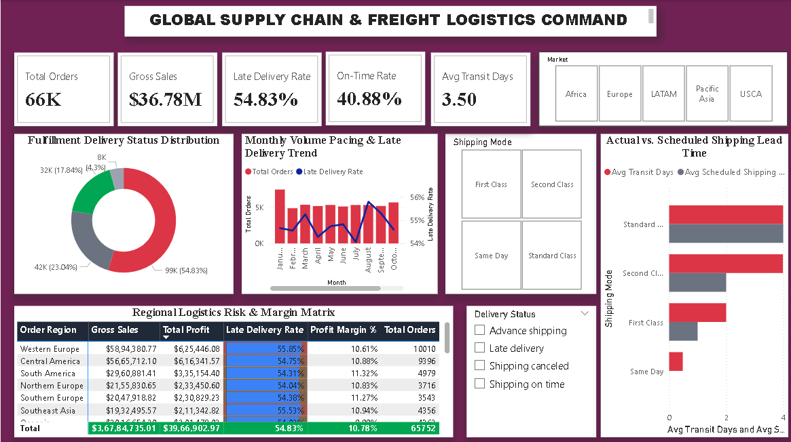

# 📦 Day 15: Global Supply Chain, Freight Logistics & Fulfillment SLA Analytics



## 📌 Executive Overview
This operational logistics command center evaluates fulfillment reliability, transit lead times, and delivery SLA compliance across **180,519 order line items** (representing **65,752 distinct customer purchase orders**) totaling **$36.78M in gross sales**. It benchmarks delivery bottlenecks across transit modes (Standard Class, Second Class, First Class, Same Day) and global markets, isolating a systemic **54.83% late delivery deficit**.

---

## 🔑 Core Logistics & Supply Chain KPIs
* **Total Distinct Orders:** 65,752 Purchase Orders
* **Total Order Line Items:** 180,519 Dispatched Items
* **Gross Sales Volume:** $36.78M ($36,784,735.01)
* **Total Operating Profit:** $3.97M ($3,966,902.97)
* **Portfolio Profit Margin:** 10.78%
* **Late Delivery Rate:** 54.83% (98,977 shipments breached scheduled SLA)
* **On-Time / Early Fulfillment Rate:** 40.88% (73,761 shipments)
* **Shipping Cancellation Rate:** 4.31% (7,781 aborted shipments)
* **Average Real Shipping Transit:** 3.50 Days

---

## 📥 Data Source & Reproduction Instructions
Due to GitHub file size limitations (>25 MB web / >100 MB Git), the raw 94 MB dataset is hosted externally.

* **Primary Source:** [Kaggle - DataCo SMART SUPPLY CHAIN FOR BIG DATA ANALYSIS](https://www.kaggle.com/datasets/shashwatwork/dataco-smart-supply-chain-for-big-data-analysis)
* **File Used:** `DataCoSupplyChainDataset.csv` (180,519 records × 53 features)

### How to Run Locally:
1. Download `DataCoSupplyChainDataset.csv` from the Kaggle link above.
2. Place the file inside the `Day15 - Global-Supply-Chain-Logistics-OTIF-Performance` directory.
3. Open `Global_Supply_Chain_Logistics_Command.pbix` in **Power BI Desktop**.
4. If prompted to locate the data source, navigate to **Transform Data > Data source settings > Change Source** and select your local file path.

---

## 🛠️ Data Architecture & Power Query Transformations
* **Dimensional Optimization:** Pruned 34 non-informative metadata columns (empty descriptions, image URLs, masked customer PII) to retain 18 operational fields, reducing memory footprint and refresh latency.
* **Locale-Aware Type Parsing:** Resolved datetime parsing conflicts on US date formats (`M/d/yyyy HH:mm`) using Power Query `Using Locale (English - United States)`.

---

## 📐 Core Operational DAX Formulations

### 1. Late Delivery SLA Breach Rate
```dax
Late Delivery Rate % = 
DIVIDE(
    CALCULATE(COUNTROWS(SupplyChain), SupplyChain[Delivery Status] = "Late delivery"),
    COUNTROWS(SupplyChain),
    0
)
```

### 2. On-Time / Early Delivery Fulfillment
```dax
On-Time Delivery Rate % = 
DIVIDE(
    CALCULATE(
        COUNTROWS(SupplyChain), 
        SupplyChain[Delivery Status] IN {"Shipping on time", "Advance shipping"}
    ),
    COUNTROWS(SupplyChain),
    0
)
```

### 3. Shipping Transit Variance
```dax
Shipping Delay Variance = 
AVERAGE(SupplyChain[Days for shipping (real)]) - AVERAGE(SupplyChain[Days for shipment (scheduled)])
```

---

## 💡 Key Operational Takeaways & Carrier Insights
1. **Systemic Schedule Miscalibration:** Actual transit times consistently exceed promised delivery schedules across multiple shipping modes. Second Class shipments are promised within 2 days but average ~4 days in transit.
2. **Delivery Deficit Scale:** Over 54% of fulfillments arrive past deadline. While operating margins remain positive at 10.78%, ongoing delays introduce customer churn and return overhead.
3. **Regional Consistency:** Delivery delay rates remain tightly clustered across all operating regions (Western Europe at 55.85%, Central at 54.75%, South America at 54.31%), indicating a root issue in carrier selection and SLA quoting rather than localized port bottlenecks.

---

## 📂 Repository Contents
* `Global_Supply_Chain_Logistics_Command.pbix` — Interactive Power BI dashboard.
* `dashboard_preview.png` — Executive report preview.
* `README.md` — Project documentation, data source link, and metrics glossary.