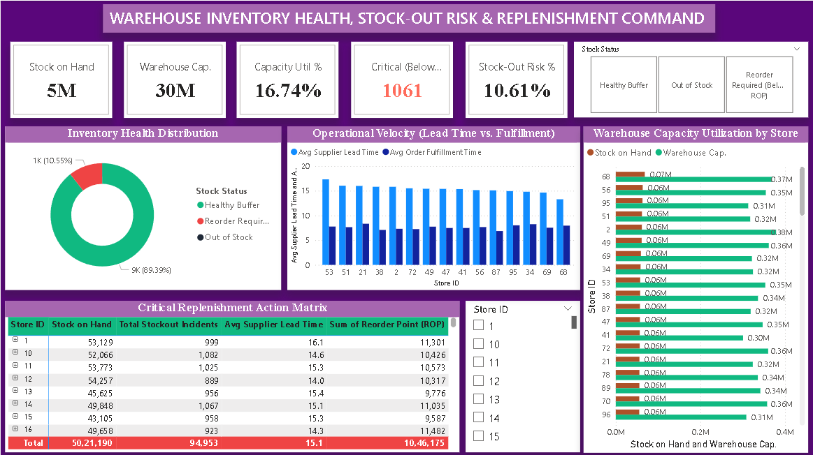

# 🏭 Day 16: Warehouse Inventory Health, Stock-Out Risk & Replenishment Command



## 📌 Executive Overview
This supply chain operations command center monitors inventory health, warehouse capacity utilization, and stockout replenishment exposure across **10,000 store-SKU combinations** across 99 distribution hubs. It bridges supplier procurement lag against internal fulfillment speeds, isolating **1,061 high-risk SKUs currently breached below their Reorder Point (ROP)**.

---

## 🔑 Key Supply Chain & Inventory KPIs
* **Total Stock on Hand:** 5.02M Units (5,021,190 units)
* **Total Warehouse Capacity:** 29.99M Units (29,987,574 storage units)
* **Storage Capacity Utilization:** 16.74%
* **Stock-Out Risk Exposure:** 10.61% (1,061 SKUs below minimum replenishment thresholds)
* **Out of Stock SKUs (Zero Balance):** 6 SKUs
* **Historical Stockout Breaches:** 94,953 incidents
* **Avg Supplier Lead Time:** 15.05 Days
* **Avg Outbound Fulfillment Speed:** 7.54 Days
* **Lead-to-Fulfillment Cycle Ratio:** 2.00x

---

## 🛠️ Data Architecture & Power Query Transformations
* **Data Source:** `inventory_monitoring.csv` (10,000 store-SKU fulfillment records).
* **ETL Pipeline:**
  * Cleaned ID dimensions (`Product ID`, `Store ID`) to discrete text classifications.
  * Formatted operational metrics (`Stock Levels`, `Reorder Point`, `Warehouse Capacity`) as whole number integers.
  * Created conditional column `Stock Health Status`:
    * `Out of Stock`: Stock Level = 0
    * `Reorder Required (Below ROP)`: Stock Level $\le$ Reorder Point
    * `Healthy Buffer`: Stock Level > Reorder Point

---

## 📐 Core Inventory DAX Formulations

### 1. Capacity Utilization %
```dax
Capacity Utilization % = 
DIVIDE(SUM(WarehouseInventory[Stock Levels]), SUM(WarehouseInventory[Warehouse Capacity]), 0)
```

### 2. Critical Replenishment SKUs
```dax
Critical SKUs Below ROP = 
CALCULATE(
    COUNTROWS(WarehouseInventory), 
    WarehouseInventory[Stock Levels] <= WarehouseInventory[Reorder Point]
)
```

### 3. Stock-Out Risk Rate
```dax
Stock-Out Risk % = 
DIVIDE([Critical SKUs Below ROP], COUNTROWS(WarehouseInventory), 0)
```

---

## 💡 Strategic Operations & Procurement Takeaways
1. **The Capacity vs. Allocation Paradox:** Total warehouse storage is significantly underutilized at **16.74%**, yet **94,953 historical stockouts** have occurred. Inventory issues stem from SKU-level misallocation rather than facility footprint constraints.
2. **Inbound Replenishment Lag:** Supplier transit times average **15.05 days**—double the internal dispatch turnaround of **7.54 days**. SKUs falling below their ROP risk a multi-day stockout window.
3. **Automated Reorder Triage:** 10.61% of catalog positions require immediate purchase order generation to prevent downstream revenue loss.

---

## 📂 Repository Contents
* `inventory_monitoring.csv` — Primary inventory tracking dataset.
* `Warehouse_Inventory_Replenishment_Command.pbix` — Interactive Power BI model.
* `dashboard_preview.png` — Executive report preview.
* `README.md` — Project documentation and KPI glossary.