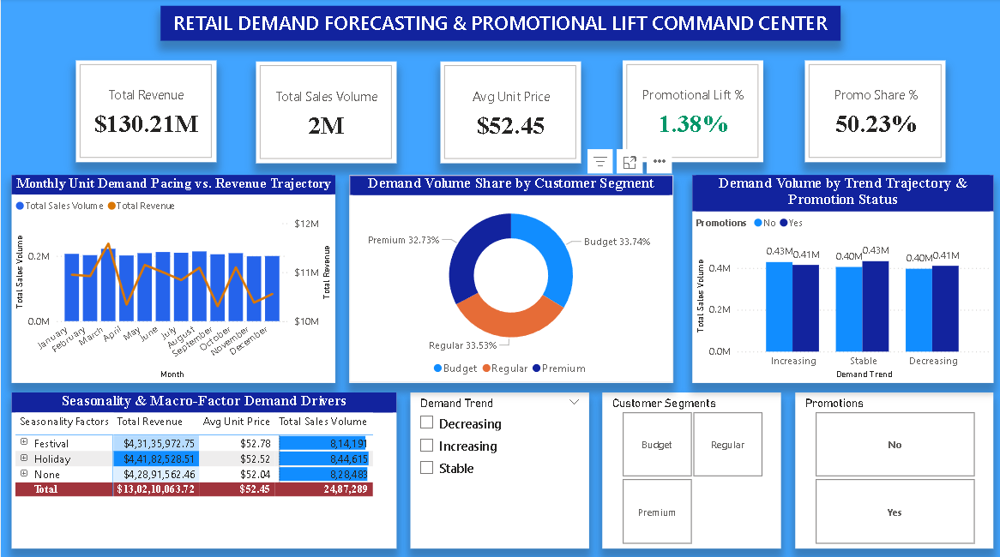

# 📈 Day 17: Retail Demand Forecasting, Promotional Lift & Demand Velocity Analytics



## 📌 Executive Overview
This commercial merchandise and demand analytics command center evaluates consumer demand patterns, promotional lift elasticity, and revenue trends across **10,000 store demand transactions** representing **2.49M demanded units** and **$130.21M in realized gross revenue** throughout 2024. It evaluates promotional effectiveness across customer tiers (Budget, Regular, Premium) and seasonal drivers, isolating a low **+1.38% incremental promotional unit lift**.

---

## 🔑 Core Demand & Merchandising KPIs
* **Gross Realized Revenue:** $130.21M ($130,210,063.72)
* **Gross Demanded Volume:** 2,487,289 Units (2.49M units)
* **Average Unit Retail Price (AUR):** $52.45
* **Average Units per Order:** 248.73 Units
* **Promotional Unit Lift:** +1.38% (+3.06% under stable demand conditions)
* **Promotional Revenue Share:** 50.23% ($65.40M)
* **Customer Segment Parity:** Budget (33.7%), Regular (33.5%), Premium (32.8%)
* **Monthly Demand Stability:** $10.3M – $11.6M per month

---

## 🛠️ Data Architecture & Power Query Transformations
* **Data Source:** `demand_forecasting.csv` (10,000 order records across 99 retail locations and 6,000+ SKUs).
* **ETL Pipeline:**
  * Cleaned discrete identifiers (`Product ID`, `Store ID`) to text types to prevent numeric aggregation.
  * Replaced `null` values in `Seasonality Factors` with `Standard Period` (3,315 rows).
  * Replaced `null` values in `External Factors` with `Baseline / None` (2,426 rows).
  * Added calculated revenue column: `Revenue = [Sales Quantity] * [Price]`.

---

## 📐 Core Merchandising DAX Formulations

### 1. Promotional Volume Lift %
```dax
Promotional Lift % = 
VAR PromoAvg = CALCULATE(AVERAGE(DemandForecasting[Sales Quantity]), DemandForecasting[Promotions] = "Yes")
VAR NonPromoAvg = CALCULATE(AVERAGE(DemandForecasting[Sales Quantity]), DemandForecasting[Promotions] = "No")
RETURN
DIVIDE(PromoAvg - NonPromoAvg, NonPromoAvg, 0)
```

### 2. Promotional Revenue Contribution %
```dax
Promo Revenue Share % = 
DIVIDE(
    CALCULATE([Total Revenue], DemandForecasting[Promotions] = "Yes"),
    [Total Revenue],
    0
)
```

### 3. Total Sales Volume
```dax
Total Sales Volume = SUM(DemandForecasting[Sales Quantity])
```

---

## 💡 Strategic Merchandising & Forecasting Insights
1. **The Promotional Inelasticity Deficit:** Active promotions drove **50.23% of gross revenue ($65.40M)**, yet produced only a **+1.38% increase in unit sales** over non-promoted periods. This indicates heavy discount cannibalization of existing baseline demand.
2. **Customer Segment Symmetry:** Revenue is evenly balanced between Budget ($44.45M), Regular ($42.51M), and Premium ($43.25M), insulating the business against single-segment macro downturns.
3. **Seasonal Pacing:** Monthly demand fluctuates by less than 12% throughout the year, demonstrating predictable replenishment schedules for distribution centers.

---

## 📂 Repository Contents
* `demand_forecasting.csv` — Transaction-level demand dataset.
* `Retail_Demand_Forecasting_Command.pbix` — Interactive Power BI dashboard.
* `dashboard_preview.png` — Executive report preview.
* `README.md` — Project documentation and metrics guide.