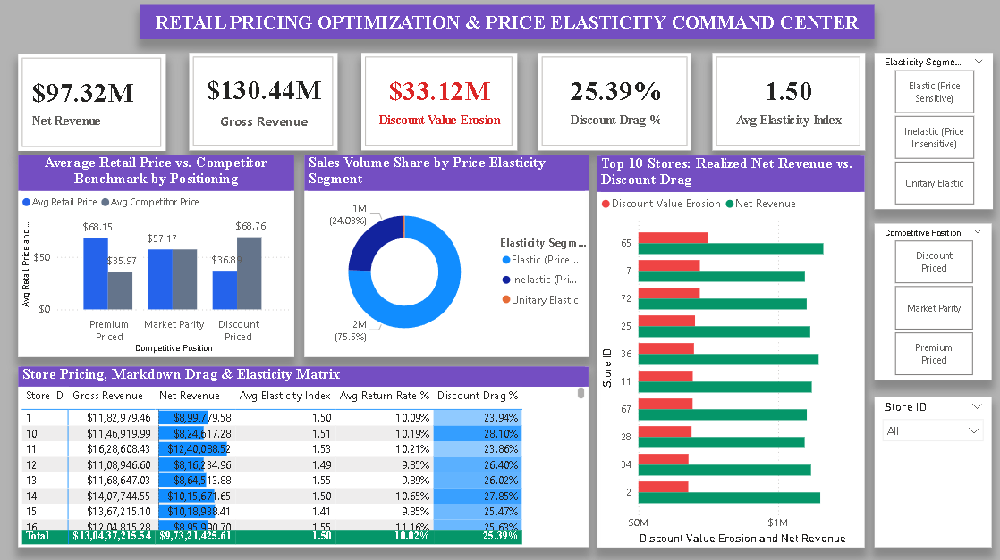

# 🏷️ Day 18: Retail Pricing Optimization, Price Elasticity & Competitive Positioning



## 📌 Executive Overview
This strategic commercial pricing command center evaluates price elasticity of demand (PED), competitive price positioning, and promotional markdown drag across **10,000 retail pricing positions** and **2.48M sold units** representing **$130.44M in gross list revenue** and **$97.32M in realized net revenue**. It isolates margin erosion from discounting and benchmarks retail pricing against external market competitors across 99 store locations.

---

## 🔑 Core Pricing & Commercial KPIs
* **Gross Retail Revenue (List Price):** $130.44M ($130,437,215.54)
* **Net Realized Revenue (Post-Discount):** $97.32M ($97,321,425.61)
* **Total Discount Margin Erosion:** $33.12M ($33,115,789.93)
* **Discount Margin Drag Rate:** 25.39%
* **Total Sales Volume:** 2,479,062 Units (2.48M units)
* **Average Retail List Price:** $52.70
* **Average Competitor Price:** $52.18 (+$0.53 net catalog premium)
* **Average Price Elasticity Index (PED):** 1.50 (Highly Elastic)
* **Average Customer Return Rate:** 10.02%
* **Catalog Elasticity Exposure:** 75.5% Elastic | 24.0% Inelastic | 0.5% Unitary

---

## 🛠️ Data Architecture & Power Query Transformations
* **Data Source:** `pricing_optimization.csv` (10,000 transaction-level pricing records).
* **ETL Pipeline:**
  * Cast categorical identifiers (`Product ID`, `Store ID`) to text dimensions.
  * Formatted monetary metrics (`Price`, `Competitor Prices`, `Discounts`, `Storage Cost`) to decimal types.
  * Calculated transactional financial columns:
    * `Gross Revenue = [Sales Volume] * [Price]`
    * `Net Revenue = [Sales Volume] * ([Price] * (1 - [Discounts] / 100))`
    * `Total Storage Cost = [Sales Volume] * [Storage Cost]`
  * Categorized economic segmentation:
    * `Elasticity Segment`: `Elastic (Price Sensitive)` for PED > 1.0; `Inelastic (Price Insensitive)` for PED < 1.0; `Unitary Elastic` for PED = 1.0.
    * `Competitive Position`: `Premium Priced` (Price > Competitor); `Discount Priced` (Price < Competitor); `Market Parity` (Price = Competitor).

---

## 📐 Core Pricing DAX Formulations

### 1. Net Realized Revenue
```dax
Net Revenue = SUM(PricingOptimization[Net Revenue])
```

### 2. Discount Margin Erosion ($)
```dax
Discount Value Erosion = [Gross Revenue] - [Net Revenue]
```

### 3. Discount Drag %
```dax
Discount Drag % = DIVIDE([Discount Value Erosion], [Gross Revenue], 0)
```

### 4. Competitor Price Variance
```dax
Competitor Price Variance = AVERAGE(PricingOptimization[Price]) - AVERAGE(PricingOptimization[Competitor Prices])
```

---

## 💡 Strategic Pricing & Monetization Insights
1. **The $33.12M Markdown Drag:** Over 25.39% of gross top-line revenue was conceded to discounts. A major portion was applied to inelastic SKUs (24% of volume), where discounting fails to drive incremental unit expansion and simply erodes margin.
2. **Elastic Demand Dominance:** 75.5% of total volume is price-elastic (PED = 1.50). Targeted dynamic discounting on these specific items drives strong volume lift, whereas inelastic items should be returned to full list price.
3. **Premium Brand Equity:** Premium-priced SKUs averaged $68.15 vs. $35.97 for competitors (+89.5% premium), yet contributed over $63.56M in net revenue. This demonstrates pricing power that requires no promotional discounting.

---

## 📂 Repository Contents
* `pricing_optimization.csv` — Primary pricing and competitor dataset.
* `Retail_Pricing_Optimization_Command.pbix` — Interactive Power BI dashboard.
* `dashboard_preview.png` — Executive report preview.
* `README.md` — Project documentation and KPI glossary.