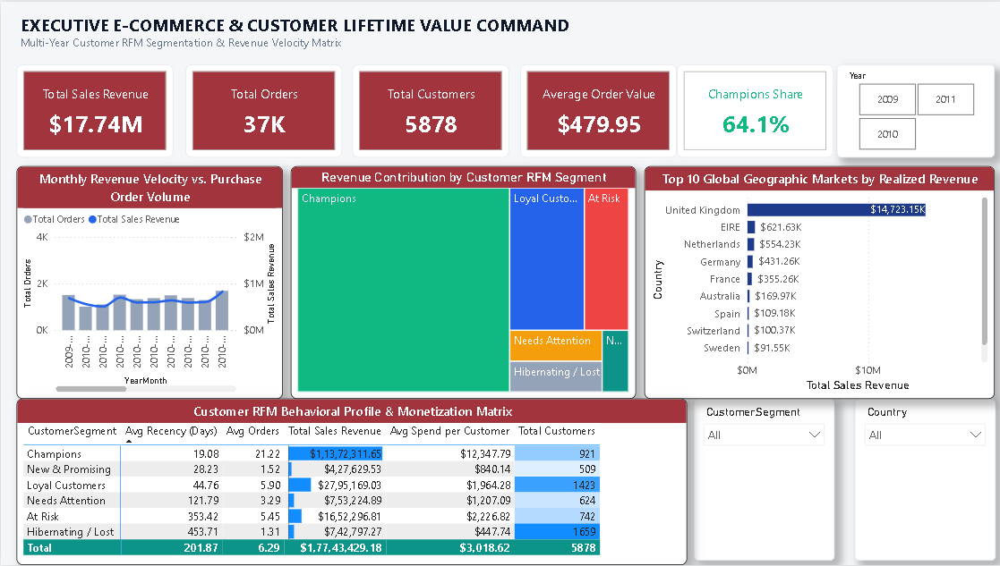

<div align="center">

# 🛍️ Day 19: E-Commerce Customer Lifetime Value (CLV) & RFM Segmentation Command

**Enterprise-Grade Behavioral Analytics, Star Schema Architecture & Cohort Retention Modeling**

[](https://powerbi.microsoft.com/)
[](https://learn.microsoft.com/en-us/dax/)
[](https://en.wikipedia.org/wiki/Star_schema)
[](https://www.kaggle.com/datasets/mashlyn/online-retail-ii-uci)

<br/>



</div>

---

## 📌 Executive Summary

This enterprise e-commerce command center bridges raw transaction logs with multi-dimensional customer behavioral economics. Analyzing **805,549 audited transactions** across **41 global markets**, the model isolates high-value customer cohorts using an enterprise **Recency, Frequency, and Monetary (RFM)** framework to reveal portfolio vulnerabilities, lifetime customer value, and at-risk revenue exposure.

> [!IMPORTANT]
> **Key Strategic Finding:** While the business captured **$17.74M in gross revenue**, a targeted cohort of **921 Champions (15.7% of customers)** accounts for **$11.37M (64.1%) of total sales**, exposing the enterprise to severe revenue concentration risk if retention slips.

---

## 📊 Core Commercial & Customer Economics

| Strategic Metric | Baseline Value | Operational Definition & Impact |
| :--- | :---: | :--- |
| **Gross Sales Revenue** | **`$17.74M`** | Realized cumulative sales turnover post-data hygiene. |
| **Total Dispatched Orders** | **`36,969`** | Unique verified invoice transactions across 41 countries. |
| **Active Customer Base** | **`5,878`** | Registered B2B & wholesale customer accounts. |
| **Average Order Value (AOV)** | **`$479.95`** | Mean transaction basket value across catalog items. |
| **Average Customer Spend** | **`$3,018.62`** | Mean lifetime value (LTV) generated per active client. |
| **Champions Revenue Share** | **`64.1%`** | Share of revenue driven by the top 921 VIP accounts. |
| **At-Risk Capital Exposure** | **`$1.65M`** | Lapsed spend from 742 previously active repeat buyers. |
| **Primary Geographic Hub** | **`83.0% (UK)`** | Domestic home market turnover totaling **$14.72M**. |

---

## 🧱 Data Architecture & Star Schema Model

The report abandons flat-table performance bottlenecks in favor of a normalized **Star Schema** built with DAX dimension tables:

```
                  ┌───────────────────────────────┐
                  │            DimDate            │
                  │   (Continuous Date Matrix)    │
                  └───────────────┬───────────────┘
                                  │ 1
                                  │ *
┌─────────────────────────────────┴─────────────────────────────────┐
│                             FactSales                             │
│                  (805,549 Audited Order Records)                  │
└─────────────────────────────────┬─────────────────────────────────┘
                                  │ *
                                  │ 1
                  ┌───────────────┴───────────────┐
                  │          DimCustomer          │
                  │   (Dynamic RFM Segmentation)  │
                  └───────────────────────────────┘
```

### ⚙️ Power Query ETL Pipeline
* **Guest Checkout Isolation:** Pruned **243,007 rows** with null `Customer ID` to enable account-level behavioral tracking.
* **Accounting Adjustments & Return Filtering:** Filtered out negative quantities (`Quantity <= 0`), adjustments (`Price <= 0`), and cancellations (`Invoice` starting with `C`).
* **Relational Integrity Normalization:** Standardized `InvoiceDate` from timestamp (`YYYY-MM-DD HH:MM:SS`) to discrete calendar Date (`YYYY-MM-DD`) to ensure a direct `1 : *` relationship with `DimDate`.

---

## 📐 Enterprise DAX Formulations

### 1. Dynamic Customer RFM Segmentation Table
```dax
DimCustomer = 
VAR SnapshotDate = DATE(2011, 12, 10)
VAR CustomerBase = 
    SUMMARIZE(
        FactSales,
        FactSales[Customer ID],
        "LastPurchaseDate", MAX(FactSales[InvoiceDate]),
        "TotalOrders", DISTINCTCOUNT(FactSales[Invoice]),
        "TotalSpend", SUM(FactSales[SalesAmount]),
        "Country", MAX(FactSales[Country])
    )
RETURN
    ADDCOLUMNS(
        CustomerBase,
        "RecencyDays", DATEDIFF([LastPurchaseDate], SnapshotDate, DAY),
        "CustomerSegment", 
            SWITCH(
                TRUE(),
                -- Champions: High frequency, substantial spend, recent purchase
                DATEDIFF([LastPurchaseDate], SnapshotDate, DAY) <= 60 && [TotalOrders] >= 6 && [TotalSpend] >= 2500, "Champions",
                -- Loyal Customers: Consistent repeat orders, active within 4 months
                DATEDIFF([LastPurchaseDate], SnapshotDate, DAY) <= 120 && [TotalOrders] >= 3, "Loyal Customers",
                -- New & Promising: Recent buyers with initial traction
                DATEDIFF([LastPurchaseDate], SnapshotDate, DAY) <= 60 && [TotalOrders] < 3, "New & Promising",
                -- At Risk: Significant historical buyers dormant for >6 months
                DATEDIFF([LastPurchaseDate], SnapshotDate, DAY) > 180 && [TotalOrders] >= 3, "At Risk",
                -- Hibernating / Lost: Lapsed low-frequency accounts
                DATEDIFF([LastPurchaseDate], SnapshotDate, DAY) > 180 && [TotalOrders] < 3, "Hibernating / Lost",
                -- Mid-tier balance
                "Needs Attention"
            )
    )
```

### 2. Champions Revenue Share %
```dax
Champions Revenue Share % = 
DIVIDE(
    CALCULATE([Total Sales Revenue], DimCustomer[CustomerSegment] = "Champions"),
    CALCULATE([Total Sales Revenue], ALL(DimCustomer[CustomerSegment])),
    0
)
```

### 3. Average Order Value (AOV)
```dax
Average Order Value = 
DIVIDE(
    SUM(FactSales[SalesAmount]), 
    DISTINCTCOUNT(FactSales[Invoice]), 
    0
)
```

---

## 🎯 Behavioral RFM Cohort Matrix

| Customer Segment | Active Accounts | Avg Recency | Avg Orders | Realized Spend | Avg Spend / Client | Strategic Action Plan |
| :--- | :---: | :---: | :---: | :---: | :---: | :--- |
| 🟢 **Champions** | **921** | 19.1 Days | 21.2 | **$11.37M** | $12,347.79 | Dedicated VIP success management & early catalog access. |
| 🔵 **Loyal Customers** | **1,423** | 44.8 Days | 5.9 | **$2.79M** | $1,964.28 | Upsell loyalty bundles & volume-tier rebate incentives. |
| 🔴 **At Risk** | **742** | 353.4 Days | 5.5 | **$1.65M** | $2,226.82 | **Priority Win-Back:** Automated personalized outreach campaigns. |
| 🟡 **Needs Attention** | **624** | 121.8 Days | 3.3 | **$0.75M** | $1,207.09 | Mid-tier nurturing workflows to prevent churn slippage. |
| ⚪ **Hibernating / Lost** | **1,659** | 453.7 Days | 1.3 | **$0.74M** | $447.74 | Low-cost programmatic email re-engagement or deprioritization. |
| 🟣 **New & Promising** | **509** | 28.2 Days | 1.5 | **$0.43M** | $840.14 | Onboarding nurture sequence to secure second purchase. |

---

## 💡 Strategic Executive Insights

1. **The 64% Concentration Dilemma:** Over **$11.37M** in revenue depends on just **921 accounts**. A structured account-retention framework is critical—losing 50 of these buyers would impact EBITDA more than losing 1,000 one-time shoppers.
2. **Immediate $1.65M Reactivation Runway:** The **742 At-Risk accounts** averaged 5.5 orders and spent over $2,200 each before going dormant. Re-engaging these known buyers offers a significantly lower customer acquisition cost (CAC) than net-new acquisition.
3. **Cross-Border Expansion Vectors:** While domestic UK accounts for 83% of turnover, established footholds in Ireland ($621K), the Netherlands ($554K), Germany ($431K), and France ($355K) provide proven expansion markets for localized fulfillment.

---

## 📥 Dataset Source & Setup Guide

Due to GitHub's file storage limits (>25 MB browser / >100 MB Git), the raw 94.8 MB CSV file is hosted externally:

* **Source:** [Kaggle - Online Retail II UCI Dataset](https://www.kaggle.com/datasets/mashlyn/online-retail-ii-uci)
* **File:** `online_retail_II.csv` (1,067,371 rows × 8 columns)

### Reproduction Steps:
1. Download `online_retail_II.csv` from Kaggle.
2. Place it in your local project folder.
3. Open `Customer_Lifetime_Value_RFM_Command.pbix` in **Power BI Desktop**.
4. If a file-path prompt appears: Navigate to **Transform Data > Data source settings > Change Source** and select your local file path.

---

<div align="center">

Developed as part of the **30-Day Enterprise Power BI Portfolio Challenge**.

[Back to Master Repository](https://github.com/yusufehtesham29/30-Days-Of-Power-BI)

</div>
