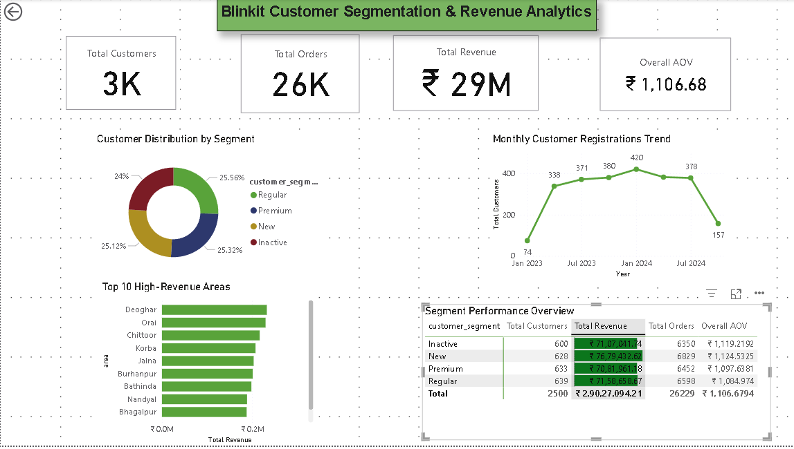

# 🛒 Day 2: Blinkit Customer Segmentation & Revenue Analytics



## 📌 Project Overview
An end-to-end Power BI dashboard analyzing customer acquisition trends, segmentation dynamics, and revenue contributions for **Blinkit (Quick Commerce)**. This project identifies high-value customer groups and geographic revenue drivers to inform targeted retention strategies.

---

## 📊 Executive Summary & Key KPIs
* **Total Customers:** 2,500
* **Total Orders:** 26,229 (~26K)
* **Total Revenue:** ₹2,90,27,094 (~₹29M / ₹2.90 Cr)
* **Overall Average Order Value (AOV):** ₹1,106.68

---

## 💡 Strategic Business Insights
1. **Balanced Acquisition Distribution:** Customer segments are evenly split across **Regular** (25.56%), **New** (25.32%), **Premium** (25.12%), and **Inactive** (24.00%), showing steady baseline inflow.
2. **₹71L Inactive Segment Opportunity:** Inactive users account for **₹71,07,041.74** across **6,350 orders**, representing a prime revenue-recovery target for automated push notifications and discount re-engagement campaigns.
3. **Regional Revenue Clustering:** High order density and top revenues originate from non-metro regional hubs like **Deoghar, Orai, Chittoor, and Korba**, highlighting expanding quick-commerce adoption in Tier-2/3 cities.
4. **Resilient Unit Economics:** The **New** customer cohort achieved the highest average order value at **₹1,124.53**, indicating high initial purchasing intent upon registration.

---

## 🛠️ Technical Stack & Implementation

### 1. Data Cleaning & Transformation (Power Query / M)
* Removed leading/trailing whitespace and normalized text cases across location columns.
* Formatted data types: text-casting for IDs and phone numbers, date parsing for registration timelines, and fixed-decimal formatting for currency precision.

### 2. DAX Calculations
* **Total Customers:**
  ```dax
  Total Customers = DISTINCTCOUNT(blinkit_customers[customer_id])