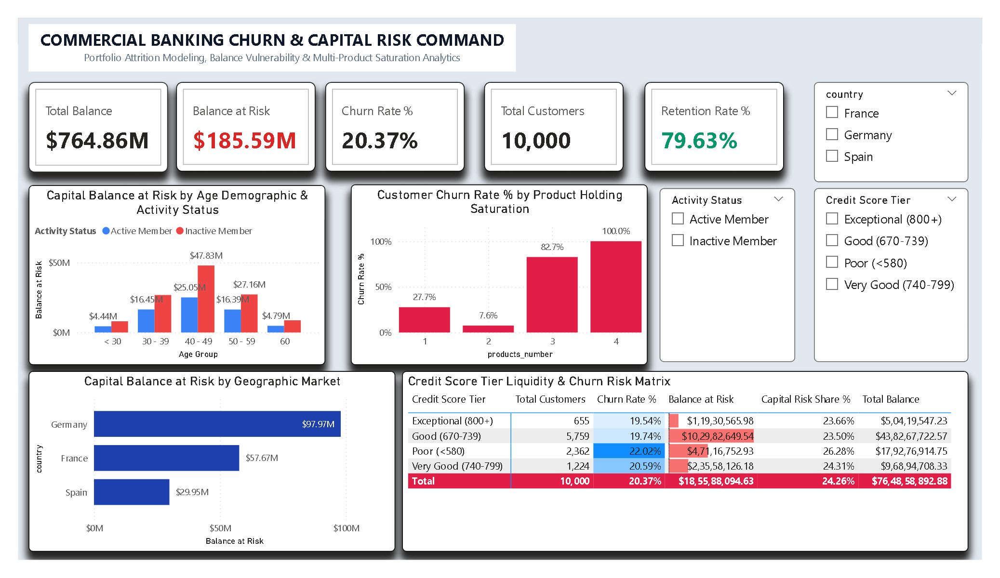

<div align="center">

# 🏦 Day 20: Commercial Banking Churn & Capital Risk Intelligence Command

**Financial Risk Analytics, Balance Attrition Modeling, Multi-Product Exposure & Capital Liquidity Diagnostics**

[](https://powerbi.microsoft.com/)
[](https://learn.microsoft.com/en-us/dax/)
[](https://en.wikipedia.org/wiki/Retail_banking)
[](https://www.kaggle.com/)

<br/>



</div>

---

## 📁 Repository & File Manifest

```text
Day20 - Commercial-Banking-Churn-Capital-Risk/
│
├── 📊 Bank_Customer_Churn_Capital_Risk.pbix   # Production Power BI Application & Data Model
├── 📄 Bank Customer Churn Prediction.csv     # Cleaned Source Dataset (10,000 rows × 12 features)
├── 🖼️ dashboard_preview.png                   # High-Resolution Executive Dashboard Screenshot
└── 📝 README.md                              # Comprehensive Project Documentation & DAX Catalog
```

### File Details & Data Footprint
| File Name | File Type | Size | Description |
| :--- | :---: | :---: | :--- |
| **`Bank_Customer_Churn_Capital_Risk.pbix`** | Power BI Report | ~2.4 MB | Contains data model, DAX measures, UI design system, and responsive visualizations. |
| **`Bank Customer Churn Prediction.csv`** | CSV Data Source | 561 KB | 10,000 audited client banking profiles across France, Germany, and Spain. |
| **`dashboard_preview.png`** | Image (PNG) | ~1.1 MB | Full-canvas executive preview for documentation and portfolio presentation. |
| **`README.md`** | Markdown Document | ~12 KB | Technical specifications, business intelligence takeaways, and formula definitions. |

---

## 📌 Executive Summary

This commercial banking intelligence command center evaluates customer attrition through a **capital liquidity exposure framework**. Rather than treating churn as a simple binary head-count loss, the report measures the dollar impact of departing balances on loan reserves, net interest margin (NIM), and bank liquidity. Analyzing **10,000 retail banking accounts** across Western Europe representing **$764.86M in total portfolio deposits**, this model pinpoints regional risk concentrations, cross-selling fatigue, and age-based wealth migration.

> [!IMPORTANT]
> **Key Capital Risk Finding:** The bank maintains a **20.37% account attrition rate (2,037 departed accounts)**, which accounts for **$185.59M in lost deposits (24.26% of all capital)**. Departing customers carried an average balance of **$91,108.54**, compared to **$72,745.30** for retained clients (+25.2% higher balance), demonstrating an active outflow of affluent capital.

---

## 📊 Core Banking & Risk Economics

| Strategic Banking Metric | Portfolio Benchmark | Strategic Risk & Financial Meaning |
| :--- | :---: | :--- |
| **Total Portfolio Balance** | **`$764,858,892.88` ($764.86M)** | Gross deposit pool held across all 10,000 audited account profiles. |
| **Capital Balance at Churn Risk** | **`$185,588,094.63` ($185.59M)** | Cumulative deposited liquidity forfeited to external competitor institutions. |
| **Retained Deposit Base** | **`$579,270,798.25` ($579.27M)** | Stable capital base supporting commercial credit operations and lending reserves. |
| **Portfolio Churn Rate %** | **`20.37%`** | Overall percentage of customer profiles exiting the institution. |
| **Account Retention Rate %** | **`79.63%`** | Retained commercial client baseline representing 7,963 accounts. |
| **Capital Risk Share %** | **`24.26%`** | Proportion of total bank deposits forfeited to churn (exceeds customer churn rate by 3.89%). |
| **Mean Churned Client Balance** | **`$91,108.54`** | Average balance surrendered per departing customer. |
| **Mean Retained Client Balance** | **`$72,745.30`** | Average balance maintained per retained active customer. |
| **German Outflow Exposure** | **`$97.97M (52.8%)`** | Concentration of all lost portfolio capital originating from Germany. |
| **Product Holding Attrition Spike** | **`82.71% – 100.00%`** | Attrition observed among clients pushed into 3 or 4 products. |

---

## 🧱 Data Architecture & Feature Engineering

The model runs on an analytical single-table star/fact architecture (`BankChurn`) enriched via Power Query transformations and DAX calculated metrics.

### 1. Data Schema & Dictionary
| Raw Column | Target Data Type | Description | Transformation / Classification |
| :--- | :---: | :--- | :--- |
| `customer_id` | Text | Unique client account identifier | Explicitly converted to Text to prevent arithmetic auto-summing |
| `credit_score` | Whole Number | Consumer credit evaluation (350–850) | Segmented into 5 FICO Credit Rating Tiers |
| `country` | Text | Domiciled banking market | France, Germany, Spain |
| `gender` | Text | Account holder biological gender | Categorical demographic dimension |
| `age` | Whole Number | Customer chronological age | Segmented into 5 demographic lifecycle age bands |
| `tenure` | Whole Number | Total years as an active client (0–10) | Direct numerical dimension |
| `balance` | Decimal Number | Current liquid deposited balance | Core liquidity metric |
| `products_number` | Whole Number | Total bank products held (1, 2, 3, 4) | Product depth and bundling saturation indicator |
| `credit_card` | Whole Number | Credit card facility ownership (1/0) | Transformed to descriptive `Credit Card Status` |
| `active_member` | Whole Number | Bank engagement activity status (1/0) | Transformed to descriptive `Activity Status` |
| `estimated_salary` | Decimal Number | Client modeled annual income | Earning capacity metric |
| `churn` | Whole Number | Attrition status flag (1 = Exited, 0 = Retained) | Primary target variable and basis for all risk DAX measures |

### 2. Power Query M Transformations
* **Dimensional Cleaning:** Cast categorical identifiers (`customer_id`) to `type text` and financial metrics (`balance`, `estimated_salary`) to `type number`.
* **FICO Credit Score Tiers:**
  ```powerquery
  = Table.AddColumn(#"Changed Type", "Credit Score Tier", each 
      if [credit_score] >= 800 then "Exceptional (800+)"
      else if [credit_score] >= 740 then "Very Good (740-799)"
      else if [credit_score] >= 670 then "Good (670-739)"
      else if [credit_score] >= 580 then "Fair (580-669)"
      else "Poor (<580)", type text)
  ```
* **Demographic Age Brackets:**
  ```powerquery
  = Table.AddColumn(#"Added Credit Tier", "Age Group", each 
      if [age] < 30 then "< 30"
      else if [age] <= 39 then "30 - 39"
      else if [age] <= 49 then "40 - 49"
      else if [age] <= 59 then "50 - 59"
      else "60+", type text)
  ```
* **Descriptive Business Encodings:**
  * `Activity Status`: `if [active_member] = 1 then "Active Member" else "Inactive Member"`
  * `Churn Status`: `if [churn] = 1 then "Churned" else "Retained"`
  * `Credit Card Status`: `if [credit_card] = 1 then "Has Credit Card" else "No Credit Card"`

---

## 📐 Complete DAX Measure Library

All measures are centralized in an independent measure folder (`_Measures`):

### 1. Capital & Liquidity Measures

```dax
// Total deposited portfolio liquidity across all accounts
Total Portfolio Balance = 
SUM(BankChurn[balance])
```

```dax
// Gross capital surrendered to customer attrition
Balance at Churn Risk = 
CALCULATE(
    [Total Portfolio Balance],
    BankChurn[churn] = 1
)
```

```dax
// Stable retained capital backing active customer relationships
Retained Balance = 
CALCULATE(
    [Total Portfolio Balance],
    BankChurn[churn] = 0
)
```

```dax
// Percentage of total deposited capital forfeited to attrition
Capital Risk Share % = 
DIVIDE(
    [Balance at Churn Risk],
    [Total Portfolio Balance],
    0
)
```

### 2. Customer Volume & Headcount Measures

```dax
// Total audited client base
Total Customers = 
COUNTROWS(BankChurn)
```

```dax
// Total churned customer accounts
Churned Customers = 
CALCULATE(
    COUNTROWS(BankChurn), 
    BankChurn[churn] = 1
)
```

```dax
// Total retained customer accounts
Retained Customers = 
CALCULATE(
    COUNTROWS(BankChurn), 
    BankChurn[churn] = 0
)
```

### 3. Key Risk & Attrition Rates

```dax
// Primary portfolio customer attrition rate
Portfolio Churn Rate % = 
DIVIDE(
    [Churned Customers], 
    [Total Customers], 
    0
)
```

```dax
// Portfolio account retention rate
Retention Rate % = 
1 - [Portfolio Churn Rate %]
```

```dax
// Active member specific churn rate
Active Member Churn Rate % = 
DIVIDE(
    CALCULATE(COUNTROWS(BankChurn), BankChurn[churn] = 1, BankChurn[active_member] = 1),
    CALCULATE(COUNTROWS(BankChurn), BankChurn[active_member] = 1),
    0
)
```

```dax
// Inactive member specific churn rate
Inactive Member Churn Rate % = 
DIVIDE(
    CALCULATE(COUNTROWS(BankChurn), BankChurn[churn] = 1, BankChurn[active_member] = 0),
    CALCULATE(COUNTROWS(BankChurn), BankChurn[active_member] = 0),
    0
)
```

### 4. Financial Averages & Profiling Measures

```dax
// Average balance held by departing clients (Liquidity Drain Severity)
Avg Churned Balance = 
DIVIDE(
    [Balance at Churn Risk], 
    [Churned Customers], 
    0
)
```

```dax
// Average balance held by retained clients
Avg Retained Balance = 
DIVIDE(
    [Retained Balance], 
    [Retained Customers], 
    0
)
```

```dax
// Weighted average portfolio credit score
Average Credit Score = 
AVERAGE(BankChurn[credit_score])
```

```dax
// Weighted average portfolio customer age
Average Customer Age = 
AVERAGE(BankChurn[age])
```

```dax
// Estimated salary average
Average Estimated Salary = 
AVERAGE(BankChurn[estimated_salary])
```

---

## 🎯 Behavioral Risk & Cross-Sell Analysis

### 1. The Product Holding Saturation Cliff
| Products Held | Client Count | Churned Clients | Churn Rate % | Total Balance | Balance at Risk | Portfolio Diagnostic |
| :---: | :---: | :---: | :---: | :---: | :---: | :--- |
| **1 Product** | 5,084 | 1,409 | 27.71% | $501.04M | $129.67M | Moderate vulnerability; low engagement or single-service use. |
| **2 Products** | 4,590 | 348 | **7.58%** | $238.13M | $31.41M | **Optimal Retention Anchor:** High loyalty and relationship depth. |
| **3 Products** | 266 | 220 | **82.71%** | $20.07M | $18.89M | **Attrition Cliff:** Cross-sell fatigue and product friction. |
| **4 Products** | 60 | 60 | **100.00%** | $5.62M | $5.62M | **Complete Outflow:** Systemic dissatisfaction among bundled accounts. |

### 2. Geographic Risk Concentration
| Country | Total Clients | Churned Clients | Churn Rate % | Portfolio Balance | Balance at Risk | Capital Risk Share |
| :--- | :---: | :---: | :---: | :---: | :---: | :---: |
| **Germany** | 2,509 | 814 | **32.44%** | $300.40M | **$97.97M** | **52.79%** |
| **France** | 5,014 | 810 | 16.15% | $311.33M | $57.67M | 31.07% |
| **Spain** | 2,477 | 413 | 16.67% | $153.12M | $29.95M | 16.14% |

### 3. Demographic Lifecycle Risk Curve
| Age Bracket | Total Clients | Churned Clients | Churn Rate % | Balance at Risk | Risk Interpretation |
| :--- | :---: | :---: | :---: | :---: | :--- |
| **< 30** | 1,641 | 124 | 7.56% | $12.45M | High stickiness, early-career accumulation. |
| **30 – 39** | 4,346 | 473 | 10.88% | $43.21M | Core prime borrowing demographic, stable retention. |
| **40 – 49** | 2,618 | 806 | 30.79% | **$72.88M** | Inflection point: Wealth accumulation and competitor shopping. |
| **50 – 59** | 869 | 487 | **56.04%** | $43.55M | **Critical Outflow:** Pre-retirement capital reallocations. |
| **60+** | 526 | 147 | 27.95% | $13.50M | Post-retirement asset drawdown and consolidation. |

---

## 💡 Strategic Executive Insights

1. **The Product Saturation Paradox:** Customers holding 2 banking products represent the bank's most loyal demographic (7.58% churn). Pushing clients into 3 or 4 products results in catastrophic churn (82.7% and 100%). Incentive structures rewarding volume over onboarding quality must be overhauled immediately.
2. **The German Market Outflow:** While France represents 50% of client volume, Germany represents **52.8% of all lost capital ($97.97M)** with an attrition rate double that of peer markets (32.44% vs. 16.15%). Regional deposit pricing, fee transparency, and localized digital banking interfaces require competitive restructuring.
3. **Pre-Retirement Wealth Protection (Ages 40–59):** Over **$116.43M in capital at risk** is concentrated in customers aged 40–59. Clients approaching retirement seek competitive yield instruments, tax-advantaged accounts, and wealth management services. Introducing premier relationship managers for depositors over $100K can prevent balance transfers to rival institutions.

---

## 🛠️ Step-by-Step Reproduction Guide

1. Clone or download this project repository:
   ```bash
   git clone [https://github.com/yusufehtesham29/30-Days-Of-Power-BI.git](https://github.com/yusufehtesham29/30-Days-Of-Power-BI.git)
   cd "Day20 - Commercial-Banking-Churn-Capital-Risk"
   ```
2. Verify that `Bank Customer Churn Prediction.csv` is located in the folder.
3. Open `Bank_Customer_Churn_Capital_Risk.pbix` in **Power BI Desktop**.
4. If Power BI prompts for a data source reconnect:
   * Go to **Home > Transform Data > Data source settings**.
   * Click **Change Source** and browse to your local directory containing `Bank Customer Churn Prediction.csv`.
   * Click **Close & Apply**.

---

<div align="center">

Developed as part of the **30-Day Enterprise Power BI Portfolio Challenge**.

[Back to Master Repository](https://github.com/yusufehtesham29/30-Days-Of-Power-BI)

</div>
