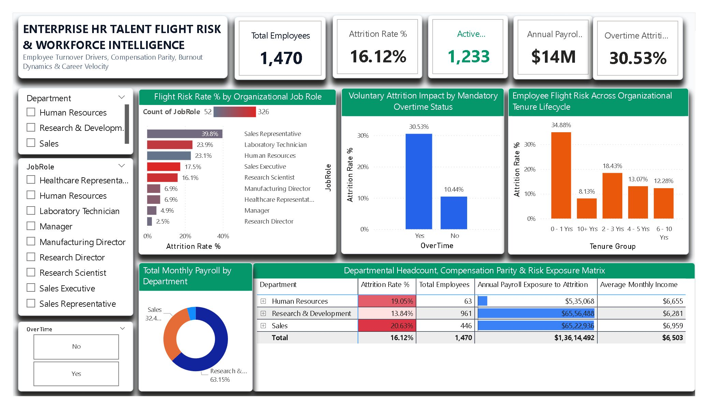

<div align="center">

# 👥 Day 22: Enterprise HR Talent Flight Risk & Workforce Intelligence Command

**Human Capital Management (HCM), Employee Turnover Drivers, Burnout Dynamics & Compensation Parity Diagnostics**

[](https://powerbi.microsoft.com/)
[](https://learn.microsoft.com/en-us/dax/)
[](https://en.wikipedia.org/wiki/People_analytics)
[](https://www.kaggle.com/datasets/pavansubhasht/ibm-hr-analytics-attrition-dataset)

<br/>



</div>

---

## 📁 Repository & File Manifest

```text
Day22 - Enterprise-HR-Talent-Flight-Risk-Attrition/
│
├── 📊 Enterprise_HR_Talent_Flight_Risk.pbix    # Production Power BI Application & Hierarchical Model
├── 📄 WA_Fn-UseC_-HR-Employee-Attrition.csv   # Source Dataset (1,470 employee records × 35 attributes)
├── 🖼️ dashboard_preview.png                   # High-Resolution Executive Dashboard Screenshot
└── 📝 README.md                               # Full Project Architecture, DAX Formulas & Risk Playbook
```

### File Details & Data Footprint
| File Name | File Type | File Size | Description |
| :--- | :---: | :---: | :--- |
| **`Enterprise_HR_Talent_Flight_Risk.pbix`** | Power BI Report | ~2.1 MB | Interactive People Analytics application, DAX measure suite, custom color hierarchies, and drill-down matrix. |
| **`WA_Fn-UseC_-HR-Employee-Attrition.csv`** | CSV Data Source | 228 KB | 1,470 audited enterprise employee profiles across 3 corporate divisions. |
| **`dashboard_preview.png`** | Image (PNG) | ~1.1 MB | High-resolution canvas preview for repository documentation and professional portfolios. |
| **`README.md`** | Markdown Document | ~13 KB | Comprehensive executive summary, workforce benchmarks, DAX formulas, and retention strategies. |

---

## 📌 Executive Summary

This enterprise People Analytics command center evaluates talent flight risk, voluntary turnover velocity, and organizational equity across **1,470 full-time corporate employees** representing **$114.71M in annualized payroll obligations**. By synthesizing compensation parity, tenure progression, job satisfaction indices, and mandatory overtime demands, this report isolates early-career attrition cliffs and pinpoints departments facing critical capacity erosion.

> [!IMPORTANT]
> **Key Talent Risk Finding:** Enterprise-wide attrition stands at **16.12% (237 departed employees)**, representing **$13.61M in annualized departed payroll capacity**. However, turnover is heavily concentrated in frontline and operational roles: **Sales Representatives suffer a 39.76% attrition rate**, and employees logging mandatory overtime experience an attrition rate of **30.53%—nearly triple the rate of non-overtime peers (10.44%)**.

---

## 📊 Core Workforce & Compensation Benchmarks

| Strategic People Metric | Baseline Value | Strategic HR & Business Meaning |
| :--- | :---: | :--- |
| **Total Headcount Base** | **`1,470` Staff** | Total audited corporate employee base. |
| **Active Retained Headcount** | **`1,233` Staff** | Stable core organizational talent pool (83.88% retention rate). |
| **Voluntary Attrition Count** | **`237` Staff** | Departed employees requiring replacement hiring or backfill. |
| **Enterprise Attrition Rate %** | **`16.12%`** | Overall workforce voluntary turnover velocity. |
| **Annualized Total Payroll** | **`$114,711,708.00` ($114.71M)** | Total annual wage and salary obligation across the workforce. |
| **Annual Payroll Attrition Loss** | **`$13,614,492.00` ($13.61M)** | Annualized wages associated with departed talent. |
| **Average Monthly Base Salary** | **`$6,502.93`** | Mean monthly base wage across the company. |
| **Retained vs. Churned Pay Gap** | **`$6,832.74` vs. `$4,787.09`** | Departed staff earned **$2,045.65 less per month** (-30.0% lower pay). |
| **Overtime Attrition Rate %** | **`30.53%`** | Turnover among staff logging mandatory overtime. |
| **Non-Overtime Attrition Rate %** | **`10.44%`** | Baseline turnover among staff with standard work hours. |
| **Early-Career Flight Risk (<1 Yr)** | **`34.88%`** | 1 in 3 new hires departs within their first 12 months. |

---

## 🧱 Data Architecture & Feature Engineering

The report runs on a structured analytical schema (`HREmployees`) cleaned in Power Query and enriched with custom DAX calculations.

### 1. Data Schema & Feature Optimization
* **Redundant Dimension Pruning:** Removed three invariant columns with zero statistical variance (`EmployeeCount = 1`, `Over18 = Y`, `StandardHours = 80`) to optimize memory footprint and reporting performance.
* **Identifier Casting:** Explicitly converted `EmployeeNumber` to `Text` to prevent automatic arithmetic aggregation.
* **Categorical Binning & Grouping:**
  * **Tenure Group:** Binned `YearsAtCompany` into operational cohorts (`0 - 1 Yrs`, `2 - 3 Yrs`, `4 - 5 Yrs`, `6 - 10 Yrs`, `10+ Yrs`) with an underlying numeric `Tenure Order` column to ensure chronological sorting.
  * **Income Tiers:** Segmented `MonthlyIncome` into strategic wage bands (`< $3K`, `$3K - $6K`, `$6K - $10K`, `$10K - $15K`, `$15K+`).
  * **Age Bands:** Grouped `Age` into demographic categories (`< 25`, `25 - 34`, `35 - 44`, `45 - 54`, `55+`).

### 2. Power Query M Transformations
```powerquery
// 1. Prune Invariant Constants
= Table.RemoveColumns(#"Changed Type", {"EmployeeCount", "Over18", "StandardHours"})

// 2. Add Binary Attrition Flag
= Table.AddColumn(#"Removed Columns", "Attrition Flag", each if [Attrition] = "Yes" then 1 else 0, Int64.Type)

// 3. Add Tenure Lifecycle Bands
= Table.AddColumn(#"Added Attrition Flag", "Tenure Group", each 
    if [YearsAtCompany] <= 1 then "0 - 1 Yrs"
    else if [YearsAtCompany] <= 3 then "2 - 3 Yrs"
    else if [YearsAtCompany] <= 5 then "4 - 5 Yrs"
    else if [YearsAtCompany] <= 10 then "6 - 10 Yrs"
    else "10+ Yrs", type text)

// 4. Add Numeric Sort Order for Tenure Group
= Table.AddColumn(#"Added Tenure Group", "Tenure Order", each 
    if [Tenure Group] = "0 - 1 Yrs" then 1
    else if [Tenure Group] = "2 - 3 Yrs" then 2
    else if [Tenure Group] = "4 - 5 Yrs" then 3
    else if [Tenure Group] = "6 - 10 Yrs" then 4
    else 5, Int64.Type)
```

---

## 📐 Complete DAX Measure Library

All measures are cataloged in an independent measure table (`_Measures`):

### 1. Headcount & Retention Measures

```dax
// Total audited corporate workforce
Total Employees = 
COUNTROWS(HREmployees)
```

```dax
// Cumulative voluntary departed employees
Attrited Employees = 
CALCULATE(
    COUNTROWS(HREmployees),
    HREmployees[Attrition] = "Yes"
)
```

```dax
// Active retained workforce base
Active Employees = 
CALCULATE(
    COUNTROWS(HREmployees),
    HREmployees[Attrition] = "No"
)
```

```dax
// Enterprise-wide voluntary attrition rate %
Attrition Rate % = 
DIVIDE(
    [Attrited Employees], 
    [Total Employees], 
    0
)
```

```dax
// Workforce retention baseline %
Retention Rate % = 
1 - [Attrition Rate %]
```

### 2. Overtime & Burnout Diagnostics

```dax
// Turnover rate among employees working overtime
Overtime Attrition Rate % = 
DIVIDE(
    CALCULATE(COUNTROWS(HREmployees), HREmployees[Attrition] = "Yes", HREmployees[OverTime] = "Yes"),
    CALCULATE(COUNTROWS(HREmployees), HREmployees[OverTime] = "Yes"),
    0
)
```

```dax
// Turnover rate among employees with standard hours
Non-Overtime Attrition Rate % = 
DIVIDE(
    CALCULATE(COUNTROWS(HREmployees), HREmployees[Attrition] = "Yes", HREmployees[OverTime] = "No"),
    CALCULATE(COUNTROWS(HREmployees), HREmployees[OverTime] = "No"),
    0
)
```

### 3. Compensation & Payroll Risk Exposure

```dax
// Gross monthly company wage obligation
Total Monthly Payroll = 
SUM(HREmployees[MonthlyIncome])
```

```dax
// Annualized total company payroll
Annualized Total Payroll = 
[Total Monthly Payroll] * 12
```

```dax
// Annualized payroll capacity surrendered to attrition
Annual Payroll Exposure to Attrition = 
CALCULATE(
    [Annualized Total Payroll],
    HREmployees[Attrition] = "Yes"
)
```

```dax
// Mean monthly base compensation
Average Monthly Income = 
AVERAGE(HREmployees[MonthlyIncome])
```

---

## 🎯 Role Vulnerability & Departmental Risk Matrix

### 1. Flight Risk Rate % by Organizational Role
| Job Role | Total Headcount | Departures | Attrition Rate % | Mean Monthly Pay | Risk Classification |
| :--- | :---: | :---: | :---: | :---: | :--- |
| **Sales Representative** | 83 | 33 | **39.76%** | $2,626.00 | **Severe Outflow Hotspot:** Low compensation, high pressure. |
| **Laboratory Technician** | 259 | 62 | **23.94%** | $3,237.17 | High technical attrition; compensation ceiling friction. |
| **Human Resources** | 52 | 12 | **23.08%** | $4,235.75 | Internal retention vulnerability within HR department. |
| **Sales Executive** | 326 | 57 | 17.48% | $6,924.28 | Moderate churn; core quota-bearing revenue drivers. |
| **Research Scientist** | 292 | 47 | 16.10% | $3,239.97 | Knowledge-worker flight; competitive recruitment risk. |
| **Manufacturing Director**| 145 | 10 | 6.90% | $7,295.14 | Stable operational leadership. |
| **Healthcare Rep** | 131 | 9 | 6.87% | $7,528.76 | Stable account management retention. |
| **Manager** | 102 | 5 | 4.90% | $17,181.68 | High retention; executive compensation lock-in. |
| **Research Director** | 80 | 2 | **2.50%** | $16,033.55 | Maximum institutional stability and retention. |

### 2. Organizational Tenure Lifecycle Risk Curve
| Tenure Bracket | Total Staff | Departures | Attrition Rate % | Diagnostic Assessment |
| :---: | :---: | :---: | :---: | :--- |
| **0 – 1 Yrs** | 215 | 75 | **34.88%** | **The Onboarding Cliff:** 1 in 3 new hires departs in Year 1. |
| **2 – 3 Yrs** | 255 | 47 | 18.43% | Mid-level career mobility; market shopping window. |
| **4 – 5 Yrs** | 306 | 40 | 13.07% | Core institutional stabilizing workforce. |
| **6 – 10 Yrs** | 448 | 55 | 12.28% | Senior tenured contributors; predictable retention. |
| **10+ Yrs** | 246 | 20 | **8.13%** | Executive stability; lowest organizational flight risk. |

---

## 💡 Strategic Executive Insights

1. **The Overtime Burnout Multiplier (30.5% vs. 10.4%):** Employees working mandatory overtime churn at nearly three times the rate of non-overtime peers. Overtime acts as an accelerator for voluntary attrition. Capping consecutive overtime cycles and re-evaluating workload distribution will protect more headcount than generic wellness programs.
2. **The 35% First-Year Onboarding Cliff:** Nearly 35% of all new hires exit within their first 12 months on the job. Replacing an employee typically costs between 50% and 150% of their annual salary in recruiting, onboarding, and ramp-up downtime. Implementing structured 30-60-90 day check-ins, mentorship pairing, and role expectation alignment can curb early talent loss.
3. **Sales Representative Pay Disparity ($2,626/month):** Sales Representatives exhibit the highest attrition across the enterprise (39.76%), while also holding the lowest average base salary ($2,626/mo). Restructuring sales compensation toward higher base-to-commission ratios will stabilize client relationship continuity and stem recurring recruiting expenses.

---

## 📥 Dataset Source & Setup Guide

* **Source:** [Kaggle - IBM HR Analytics Employee Attrition & Performance](https://www.kaggle.com/datasets/pavansubhasht/ibm-hr-analytics-attrition-dataset)
* **File:** `WA_Fn-UseC_-HR-Employee-Attrition.csv` (1,470 rows × 35 columns)

### Reproduction Steps:
1. Clone or download this project repository:
   ```bash
   git clone [https://github.com/yusufehtesham29/30-Days-Of-Power-BI.git](https://github.com/yusufehtesham29/30-Days-Of-Power-BI.git)
   cd "Day22 - Enterprise-HR-Talent-Flight-Risk-Attrition"
   ```
2. Verify that `WA_Fn-UseC_-HR-Employee-Attrition.csv` is in the folder.
3. Open `Enterprise_HR_Talent_Flight_Risk.pbix` in **Power BI Desktop**.
4. If prompted to reconnect the data source:
   * Go to **Home > Transform Data > Data source settings**.
   * Select **Change Source**, point to your local `WA_Fn-UseC_-HR-Employee-Attrition.csv`, and click **Close & Apply**.

---

<div align="center">

Developed as part of the **30-Day Enterprise Power BI Portfolio Challenge**.

[Back to Master Repository](https://github.com/yusufehtesham29/30-Days-Of-Power-BI)

</div>