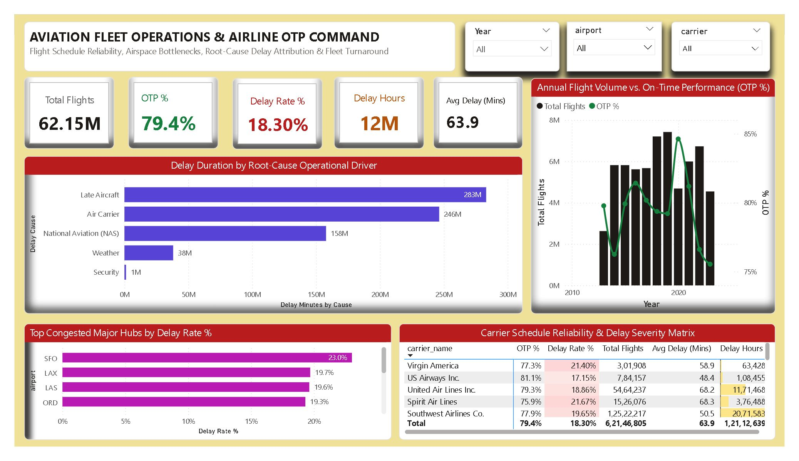

<div align="center">

# ✈️ Day 23: Aviation Fleet Operations & Airline On-Time Performance (OTP) Command

**Commercial Aviation Logistics, Flight Schedule Reliability, Root-Cause Delay Attribution & Hub Airspace Diagnostics**

[](https://powerbi.microsoft.com/)
[](https://learn.microsoft.com/en-us/dax/)
[](https://en.wikipedia.org/wiki/Airline)
[](https://www.kaggle.com/datasets/sriharshaeedala/airline-delay)

<br/>



</div>

---

## 📁 Repository & File Manifest

```text
Day23 - Aviation-Fleet-Operations-Flight-Delay-Analytics/
│
├── 📊 Aviation_Fleet_Operations_Flight_Delay.pbix  # Production Power BI Application & Star Schema Model
├── 📄 Airline_Delay_Cause.csv                    # Bureau of Transportation Statistics (BTS) Flight Records
├── 🖼️ dashboard_preview.png                       # High-Resolution Executive Dashboard Screenshot
└── 📝 README.md                                  # Full Project Architecture, DAX Formulas & Risk Playbook
```

### File Details & Data Footprint
| File Name | File Type | File Size | Description |
| :--- | :---: | :---: | :--- |
| **`Aviation_Fleet_Operations_Flight_Delay.pbix`** | Power BI Report | ~4.2 MB | Multi-year aviation operational model, custom DAX metrics, Nordic Sand UI theme, and root-cause breakdowns. |
| **`Airline_Delay_Cause.csv`** | CSV Data Source | 27.5 MB | 171,666 carrier-airport monthly aggregate records spanning 2013 through 2023. |
| **`dashboard_preview.png`** | Image (PNG) | ~1.2 MB | High-resolution canvas view used for documentation and portfolio showcases. |
| **`README.md`** | Markdown Document | ~14 KB | Comprehensive operational problem statement, aviation benchmarks, DAX catalog, and reproduction steps. |

---

## 📌 Executive Summary

This executive fleet operations command center analyzes commercial airline turnaround reliability, airspace capacity bottlenecks, and root-cause delay attribution across the United States National Airspace System (NAS). Evaluating **62.15 Million commercial flights** across **21 scheduled passenger carriers** and **395 airports** over a 10-year span (2013–2023), this report quantifies schedule integrity using the FAA/DOT **A14 standard** (arrival within 15 minutes of schedule) and isolates operational cost drivers.

> [!IMPORTANT]
> **Operational Capacity Takeaway:** The monitored commercial aviation network achieved a baseline **79.38% On-Time Performance (OTP)**, incurring **11.38M delayed flights (18.30%)** and **726.76M cumulative delay minutes (12.11M flight hours / ~1,383 years of passenger gate delay)**. Crucially, **72.86% of all delay minutes** stem from just two operational drivers: downstream **Late Aircraft cascades (38.96%)** and internal **Carrier maintenance/crewing turnaround friction (33.90%)**, rather than severe weather (5.25%).

---

## 📊 Core Aviation & Fleet Operations Benchmarks

| Strategic Aviation Metric | Baseline Portfolio Benchmark | Operational & Industry Significance |
| :--- | :---: | :--- |
| **Total Monitored Flights** | **`62,146,805` Flights** | Commercial arrival flight operations tracked across U.S. airports (2013–2023). |
| **On-Time Performance (OTP) Rate %** | **`79.38%` (49.33M Flights)** | Flights arriving within 15 minutes of scheduled gate arrival (A14 Standard). |
| **Flight Arrival Delay Rate %** | **`18.30%` (11.38M Flights)** | Flights delayed by 15 minutes or longer (`arr_del15`). |
| **Total Flight Cancellations** | **`1,290,923` (2.08%)** | Scheduled flights cancelled prior to operation due to weather, mechanicals, or crew. |
| **Total Flight Diversions** | **`148,007` (0.24%)** | Flights rerouted to alternate airfields due to localized weather or airspace closures. |
| **Total Incurred Delay Duration** | **`726,758,355` Minutes** | **`12,112,639` Hours (~1,383 Years)** of cumulative passenger gate delay. |
| **Mean Delay per Delayed Flight** | **`63.89` Minutes** | Average delay duration once a flight breaches the 15-minute tolerance threshold. |
| **Primary Delay Cause (Cascade)** | **Late Aircraft (`38.96%`)** | Downstream ripple effects from delayed inbound planes (**283.14M mins**). |
| **Secondary Delay Cause (Operational)**| **Air Carrier (`33.90%`)** | Controllable airline maintenance, crew timing, baggage, and turnaround (**246.37M mins**). |
| **Airspace Capacity Delays (NAS)** | **NAS / FAA (`21.72%`)** | Air traffic control flow management, runway congestion, and volume limits (**157.82M mins**). |
| **Severe Meteorological Stops** | **Extreme Weather (`5.25%`)** | Direct localized blizzards, hurricanes, and convective storm cells (**38.15M mins**). |
| **Highest Delay Major Hub** | **Newark Liberty (`EWR` 24.76%)** | Followed closely by San Francisco (SFO at 23.02%) and LaGuardia (LGA at 22.29%). |

---

## 🧱 Data Architecture & Feature Engineering

The underlying model combines a cleaned flight operations table (`AirlineDelays`) linked to an automated continuous DAX Calendar table (`DimDate`) and a root-cause attribution dimension (`DimDelayCause`).

```
                  ┌───────────────────────────────┐
                  │            DimDate            │
                  │   (Continuous Date Matrix)    │
                  └───────────────┬───────────────┘
                                  │ 1
                                  │ *
                  ┌───────────────┴───────────────┐
                  │         AirlineDelays         │
                  │   (171,426 Monthly Records)   │
                  └───────────────────────────────┘
```

### 1. Data Schema & Field Reference
| Field Name | Type | Description | Engineering Transformation |
| :--- | :---: | :--- | :--- |
| `year`, `month` | Whole Number | Operational Reporting Period | Synthesized into discrete `FlightDate` `#date([year], [month], 1)` |
| `carrier` | Text | 2-Letter IATA Airline Code | Unique carrier key (e.g., `WN`, `DL`, `AA`, `UA`) |
| `carrier_name` | Text | Full Commercial Carrier Name | Primary airline reporting dimension |
| `airport` | Text | 3-Letter IATA Airport Code | Primary hub identifier (e.g., `ATL`, `ORD`, `DFW`, `SFO`) |
| `airport_name` | Text | Full Airport & City Name | Descriptive terminal identifier |
| `arr_flights` | Decimal | Total Arrived Scheduled Flights | Base operational volume metric |
| `arr_del15` | Decimal | Flights Delayed $\ge$ 15 Minutes | Primary FAA/DOT delay metric |
| `arr_cancelled` | Decimal | Flights Cancelled Prior to Arrival | Schedule cancellation metric |
| `arr_diverted` | Decimal | Flights Diverted to Alternate Airport | Operational diversion metric |
| `arr_delay` | Decimal | Total Gate Delay Duration (Minutes) | Core operational impact metric |
| `carrier_delay` | Decimal | Airline-Controllable Delay Minutes | Maintenance, crew, cleaning, fueling |
| `weather_delay` | Decimal | Extreme Severe Weather Minutes | FAA meteorological ground stops |
| `nas_delay` | Decimal | National Airspace System Minutes | ATC flow control, airport throughput limits |
| `security_delay`| Decimal | Terminal Security Breach Minutes | TSA terminal re-screening or terminal evacuations |
| `late_aircraft_delay`| Decimal| Downstream Aircraft Turnaround Minutes | Inbound aircraft arrived late from previous leg |

---

## 📐 Complete DAX Measure Library

All measures are cataloged in an independent measure table (`_Measures`):

### 1. Flight Volume & Operations Measures

```dax
// Total scheduled arriving flights
Total Flights = 
SUM(AirlineDelays[arr_flights])
```

```dax
// Flights arriving 15+ minutes behind schedule (A14 Standard)
Delayed Flights = 
SUM(AirlineDelays[arr_del15])
```

```dax
// Total scheduled flights cancelled prior to operation
Cancelled Flights = 
SUM(AirlineDelays[arr_cancelled])
```

```dax
// Total flights diverted to alternate destinations
Diverted Flights = 
SUM(AirlineDelays[arr_diverted])
```

```dax
// Total flights arriving on-time (within 14 mins of schedule)
On-Time Flights = 
[Total Flights] - [Delayed Flights] - [Cancelled Flights] - [Diverted Flights]
```

### 2. Operational Reliability Rates

```dax
// Primary industry On-Time Performance (OTP) benchmark
On-Time Performance Rate % = 
DIVIDE([On-Time Flights], [Total Flights], 0)
```

```dax
// Proportion of operations breaching the 15-minute delay threshold
Arrival Delay Rate % = 
DIVIDE([Delayed Flights], [Total Flights], 0)
```

```dax
// Flight cancellation rate
Cancellation Rate % = 
DIVIDE([Cancelled Flights], [Total Flights], 0)
```

### 3. Delay Duration & Severity Benchmarks

```dax
// Gross gate arrival delay minutes
Total Delay Minutes = 
SUM(AirlineDelays[arr_delay])
```

```dax
// Cumulative delay duration converted to operational flight hours
Total Delay Hours = 
DIVIDE([Total Delay Minutes], 60, 0)
```

```dax
// Mean duration per delayed flight (Severity Index)
Avg Delay per Delayed Flight = 
DIVIDE([Total Delay Minutes], [Delayed Flights], 0)
```

### 4. Root-Cause Attribution Measures

```dax
// Inbound aircraft ripple delay minutes
Late Aircraft Delay Minutes = SUM(AirlineDelays[late_aircraft_delay])
```

```dax
// Carrier maintenance & crewing delay minutes
Carrier Delay Minutes = SUM(AirlineDelays[carrier_delay])
```

```dax
// Air traffic control & airport capacity delay minutes
NAS Delay Minutes = SUM(AirlineDelays[nas_delay])
```

```dax
// Severe meteorological delay minutes
Weather Delay Minutes = SUM(AirlineDelays[weather_delay])
```

```dax
// Terminal security delay minutes
Security Delay Minutes = SUM(AirlineDelays[security_delay])
```

---

## 🎯 Carrier Performance & Congestion Matrix

### 1. Carrier Volume & Reliability Ranking (Min. 1M Flights)
| Airline Carrier | Total Flights | OTP Rate % | Delay Rate % | Cancel Rate % | Avg Delay (Mins) | Operational Profile |
| :--- | :---: | :---: | :---: | :---: | :---: | :--- |
| **Delta Air Lines Inc.** | 8,661,561 | **85.17%** | **13.84%** | 0.99% | 65.9 | **Best-in-Class Mega-Carrier:** Resilient hub fortress scheduling. |
| **Alaska Airlines Inc.** | 1,990,957 | **82.74%** | 15.96% | 1.30% | **49.2** | Shortest average delay duration among national airlines. |
| **United Air Lines Inc.**| 5,464,237 | 79.55% | 18.86% | 1.59% | 68.2 | Mid-tier reliability; exposed to Newark & Chicago weather. |
| **American Airlines Inc.**| 7,973,061 | 78.61% | 19.29% | 2.10% | 67.5 | Heavy exposure to DFW weather and convective storm corridors. |
| **Southwest Airlines Co.**| 12,522,217| 78.15% | 19.65% | 2.20% | **50.5** | High volume point-to-point; rapid turns keep delay duration low. |
| **JetBlue Airways** | 2,609,697 | 72.89% | **24.83%** | 2.28% | 71.0 | **Congestion Exposure:** Heavy northeast corridor (JFK/BOS) concentration. |
| **Frontier Airlines Inc.**| 1,158,943 | 72.95% | **25.14%** | 1.90% | 69.8 | High utilization ULCC model with limited spare tail capacity. |

### 2. Delay Duration by Root Cause
| Root Cause Driver | Cumulative Minutes | Equivalent Hours | Share % | Controllability & Impact |
| :--- | :---: | :---: | :---: | :--- |
| **Late Arriving Aircraft** | 283,144,335 | 4,719,072 hrs | **38.96%** | **Downstream Cascades:** Turnaround schedule buffer deficits. |
| **Air Carrier (Internal)**| 246,370,897 | 4,106,182 hrs | **33.90%** | **Controllable:** Maintenance, crew rest timing, baggage handling. |
| **National Airspace (NAS)**| 157,823,639 | 2,630,394 hrs | **21.72%** | **External/Systemic:** Air traffic control flow management & ground stops. |
| **Extreme Weather** | 38,153,170 | 635,886 hrs | **5.25%** | **Uncontrollable:** Ground freezing, convective thunderstorms, visibility. |
| **Security Incidents** | 1,265,591 | 21,093 hrs | **0.17%** | **Minimal:** Terminal clearing, TSA screening re-checks. |

---

## 💡 Strategic Executive Insights

1. **The Downstream Ripple Effect (73% Controllable/Turnaround Delay):** Contrary to passenger perception, severe weather directly accounts for only **5.25% of delay minutes**. Over 72.8% of delays stem from aircraft arriving late from previous segments (38.96%) and internal airline operations (33.90%). Increasing scheduled turn buffers on high-frequency routes can break the daily delay propagation cycle.
2. **Northeast Corridor Airspace Choke Points:** Newark (`EWR` 24.76%), San Francisco (`SFO` 23.02%), LaGuardia (`LGA` 22.29%), and JFK (`JFK` 21.26%) consistently register the highest delay rates in the nation. Carriers operating heavy schedules through these hubs face airspace saturation regardless of fleet health.
3. **The Mega-Carrier Operational Divide:** Delta Air Lines achieved an **85.17% OTP rate**, outpacing American Airlines (78.61%) and JetBlue (72.89%). Delta's investments in predictive fleet maintenance, spare tail routing, and crew scheduling resilience provide a measurable operational moat.

---

## 📥 Dataset Source & Setup Guide

* **Source:** [Kaggle - Airline Delay Cause by Sriharsha Eedala](https://www.kaggle.com/datasets/sriharshaeedala/airline-delay) (Derived from U.S. Bureau of Transportation Statistics)
* **File Used:** `Airline_Delay_Cause.csv` (171,666 rows × 21 columns)

### Reproduction Steps:
1. Clone or download this project repository:
   ```bash
   git clone [https://github.com/yusufehtesham29/30-Days-Of-Power-BI.git](https://github.com/yusufehtesham29/30-Days-Of-Power-BI.git)
   cd "Day23 - Aviation-Fleet-Operations-Flight-Delay-Analytics"
   ```
2. Verify that `Airline_Delay_Cause.csv` is present in the folder.
3. Open `Aviation_Fleet_Operations_Flight_Delay.pbix` in **Power BI Desktop**.
4. If prompted to reconnect the data source:
   * Go to **Home > Transform Data > Data source settings**.
   * Click **Change Source**, browse to your local `Airline_Delay_Cause.csv`, and click **Close & Apply**.

---

<div align="center">

Developed as part of the **30-Day Enterprise Power BI Portfolio Challenge**.

[Back to Master Repository](https://github.com/yusufehtesham29/30-Days-Of-Power-BI)

</div>
