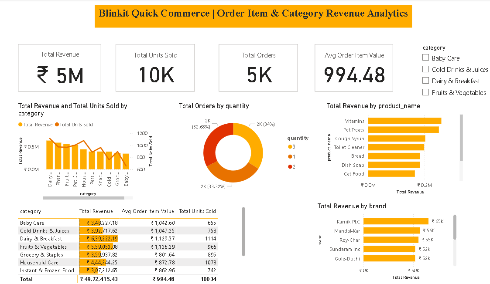

# 🛒 Day 4: Blinkit Quick Commerce — Item-Level Sales & Category Revenue Analytics



## 📌 Executive Overview
This dashboard analyzes item-level basket dynamics, SKU revenue contributions, and category-level order volumes across **5,000 orders** (totaling **10,034 units sold**) in Blinkit's quick-commerce operations. It evaluates multi-unit purchasing behavior and identifies high-revenue product lines to support assortment planning and fast-fulfillment slotting.

---

## 🔑 Key Business Metrics (KPIs)
* **Total Revenue:** ₹49.72 Lakhs
* **Total Units Sold:** 10,034 Units
* **Total Orders Analyzed:** 5,000 Orders
* **Average Order Item Value (AOV):** ₹994.48

---

## 🛠️ Data Architecture & Star Schema
* **Dimension Table:** `blinkit_products` (Contains unique `product_id`, category, brand, shelf-life, and pricing).
* **Fact Table:** `blinkit_order_items` (Contains transactional records: `order_id`, `product_id`, `quantity`, `unit_price`).
* **Relationship:** $1:*$ (One-to-Many) from `blinkit_products[product_id]` to `blinkit_order_items[product_id]` with **Single** cross-filter direction.

---

## 📐 Key DAX Measures

### 1. Total Revenue (DAX Row-by-Row Iterator)
```dax
Total Revenue = 
SUMX(
    blinkit_order_items, 
    blinkit_order_items[quantity] * blinkit_order_items[unit_price]
)
```

### 2. Total Units Sold (Scalar Aggregation)
```dax
Total Units Sold = SUM(blinkit_order_items[quantity])
```

### 3. Distinct Orders
```dax
Total Orders = DISTINCTCOUNT(blinkit_order_items[order_id])
```

### 4. Average Order Item Value (Safe Division)
```dax
Avg Order Item Value = 
DIVIDE([Total Revenue], COUNTROWS(blinkit_order_items), 0)
```

---

## 💡 Key Business Findings
1. **Top Revenue Categories:** **Dairy & Breakfast** (₹6.39L, 1,114 units) and **Pharmacy** (₹5.92L, 973 units) drive the highest gross merchandise value (GMV).
2. **Basket Quantity Behavior:** Order item distribution is evenly split across single-unit (33.3%), two-unit (32.7%), and three-unit (34.0%) line items.
3. **Supplier & Brand Concentration:** Top FMCG vendors like **Karnik PLC** (₹65K) and **Mandal-Kar** (₹56K) lead brand-level revenue contribution.