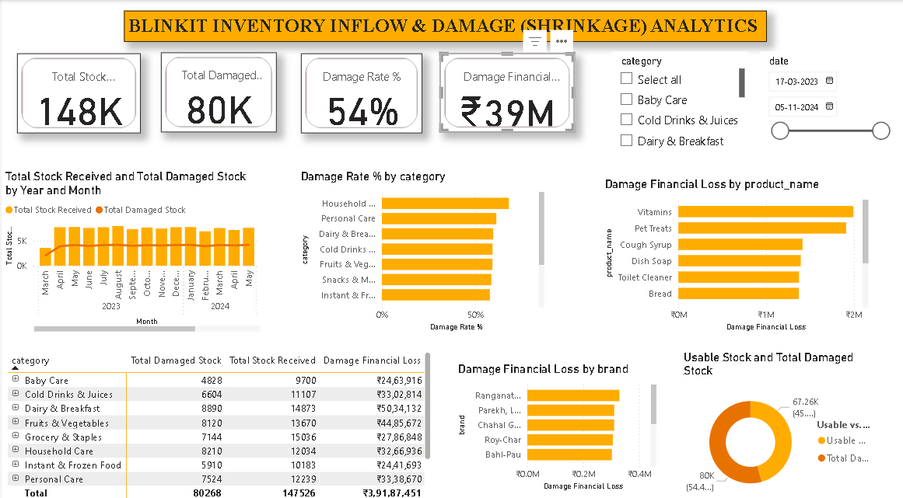

# 📦 Day 5: Blinkit Quick Commerce — Inventory Inflow & Shrinkage Analytics



## 📌 Executive Overview
This dashboard analyzes inbound inventory health, dark-store supply chain shrinkage, and product spoilage across **75,172 inflow transactions** from March 2023 to November 2024. By joining transactional inventory records with product master data, it evaluates gross stock write-offs and identifies high-risk categories and suppliers.

---

## 🔑 Key Operational Metrics (KPIs)
* **Total Stock Inflow:** 147.5K Units (147,526 units)
* **Total Damaged / Spoiled Units:** 80.3K Units (80,268 units)
* **Net Usable Inflow:** 67.3K Units (45.6% usable yield)
* **Inventory Damage Rate (Shrinkage %):** 54.4%
* **Total Financial Loss from Shrinkage:** ₹3.92 Crore (₹39,187,451)

---

## 🛠️ Data Architecture & Star Schema
* **Fact Table:** `blinkit_inventory` (75,172 rows containing daily inbound receipts and damaged stock).
* **Dimension Table 1:** `blinkit_products` (Product catalog with unit pricing, MRP, shelf life, and brand data).
* **Dimension Table 2:** `Category_Icons` (Web URL image endpoints mapped to category names).
* **Relationships:**
  * `blinkit_products[product_id]` $(1)$ $\longrightarrow$ $(*)$ `blinkit_inventory[product_id]` (Single direction)
  * `Category_Icons[category]` $(1)$ $\longrightarrow$ $(*)$ `blinkit_products[category]` (Single direction)

---

## 📐 Core DAX Measures

### 1. Total Financial Loss from Damage (Cross-Table Row Iterator)
```dax
Damage Financial Loss = 
SUMX(
    blinkit_inventory, 
    blinkit_inventory[damaged_stock] * RELATED(blinkit_products[price])
)

Damage Rate % = 
DIVIDE([Total Damaged Units], [Total Stock Received], 0)

Usable Stock = [Total Stock Received] - [Total Damaged Units]

💡 Key Business Findings
High Shrinkage Leakage: Total damage rate across the supply chain stands at 54.4%, resulting in a cumulative financial loss of ₹3.92 Crore.

Category Spoilage Hotspots: Household Care (68.2%) and Personal Care (61.5%) experience the highest unit damage rates, while Dairy & Breakfast accounts for the single largest financial loss (₹50.34 Lakhs) due to high volume and product turnover.

Supplier Risk & Accountability: Vendors like Ranganathan-Peri (₹3.29L loss, 68.5% damage rate) and Gera, Narang and Karpe (93.7% damage rate) require vendor QA protocol reviews and SLA enforcement.