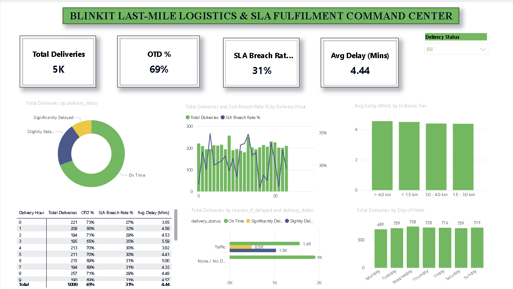

# 🛵 Day 6: Blinkit Quick Commerce — Last-Mile Logistics & SLA Fulfilment Command Center



## 📌 Executive Overview
This dashboard analyzes last-mile delivery efficiency, rider fulfillment turnaround, and SLA breach dynamics across **5,000 customer dispatches** in Blinkit's 10-minute quick-commerce delivery network. It identifies transit bottlenecks across hourly dispatch windows, delivery radii, and external road traffic conditions.

---

## 🔑 Key Operational KPIs
* **Total Completed Dispatches:** 5,000 Orders
* **On-Time Delivery (OTD) Rate:** 69.4% (3,470 Orders)
* **SLA Breach Rate:** 30.6% (1,530 Orders)
* **- Slightly Delayed (6–15 mins late):** 1,037 Orders (20.7%)
* **- Significantly Delayed (>15 mins late):** 493 Orders (9.9%)
* **Average Delivery Variance:** +4.44 Minutes

---

## 🛠️ Data Modeling & Feature Engineering

### 1. Calculated Columns (Power BI DAX)
* **Distance Tier Bins:**
```dax
Distance Tier = 
SWITCH(
    TRUE(),
    blinkit_delivery_performance[distance_km] < 1.5, "< 1.5 km",
    blinkit_delivery_performance[distance_km] <= 3.0, "1.5 - 3.0 km",
    blinkit_delivery_performance[distance_km] <= 4.0, "3.0 - 4.0 km",
    "> 4.0 km"
)


📐 Core DAX Measures

Total Deliveries
Total Deliveries = COUNTROWS(blinkit_delivery_performance)

On-Time Delivery (OTD) %
OTD % = 
DIVIDE(
    CALCULATE(
        COUNTROWS(blinkit_delivery_performance), 
        blinkit_delivery_performance[delivery_status] = "On Time"
    ),
    [Total Deliveries],
    0
)

SLA Breach Rate %
SLA Breach Rate % = 
DIVIDE(
    CALCULATE(
        COUNTROWS(blinkit_delivery_performance), 
        blinkit_delivery_performance[delivery_status] <> "On Time"
    ),
    [Total Deliveries],
    0
)

Average Delivery Variance (Minutes)
Avg Delay (Mins) = AVERAGE(blinkit_delivery_performance[delivery_time_minutes])


💡 Key Business Findings
SLA Adherence Rate: 69.4% of orders meet SLA requirements, while 30.6% experience delivery delays, resulting in an average delivery variance of +4.44 minutes.

Peak Fulfillment Bottlenecks: SLA breach rates spike above 34%–35% during evening peak windows (1 PM – 2 PM lunch rush and 8 PM – 10 PM dinner rush).

Delivery Radius Dynamics: Deliveries exceeding 4.0 km show consistent delay escalation, indicating the optimal operational radius for dark-store fulfillment is under 3.0 km.

Primary Delay Driver: Road traffic accounts for 100% of reported external delay justifications (3,098 orders).

