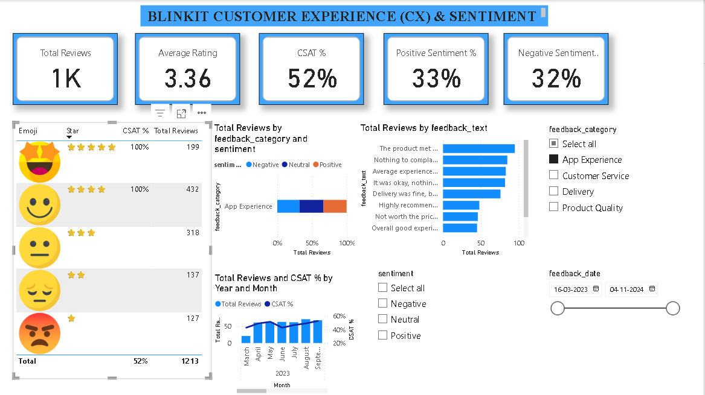

# 💬 Day 7: Blinkit Quick Commerce — Customer Experience (CX), CSAT & Sentiment Analytics



## 📌 Executive Overview
This dashboard analyzes Voice of Customer (VoC) feedback, sentiment distribution, and Customer Satisfaction (CSAT) scores across **5,000 customer feedback records** captured between March 2023 and November 2024. It combines textual feedback categorization with custom image-based rating assets to evaluate service quality across app experience, delivery, customer support, and product condition.

---

## 🔑 Key Customer Experience (CX) KPIs
* **Total Customer Reviews:** 5,000 Submissions
* **Average Customer Rating:** 3.34 / 5.0 ⭐
* **Customer Satisfaction Score (CSAT %):** 50.48% (2,524 positive ratings $\ge 4\star$)
* **Positive Sentiment Ratio:** 32.40% (1,620 Reviews)
* **Negative Sentiment Ratio:** 32.84% (1,642 Reviews)
* **Net Sentiment Score:** -0.44% (`Positive % - Negative %`)

---

## 🛠️ Data Architecture & Modeling
* **Fact Table:** `blinkit_customer_feedback` (5,000 records: `feedback_id`, `order_id`, `rating`, `feedback_text`, `feedback_category`, `sentiment`, `feedback_date`).
* **Dimension Table:** `Rating_Icons` (5 rows: `Rating`, `Emoji` web URL, `Star` rating symbols).
* **Relationship:** 
  * `Rating_Icons[Rating]` $(1) \longrightarrow (*)$ `blinkit_customer_feedback[rating]`
  * **Cardinality:** One-to-Many ($1:*$), Single cross-filter direction.
  * **Image URL Metadata:** `Rating_Icons[Emoji]` tagged as Data Category: **`Image URL`** to render visual emojis dynamically inside matrix visuals.

---

## 📐 Core DAX Measures

### 1. Total Reviews Submitted
```dax
Total Reviews = COUNTROWS(blinkit_customer_feedback)
```

### 2. Average Rating Score
```dax
Avg Rating = AVERAGE(blinkit_customer_feedback[rating])
```

### 3. Customer Satisfaction Score (CSAT %)
```dax
CSAT % = 
DIVIDE(
    CALCULATE(
        COUNTROWS(blinkit_customer_feedback), 
        blinkit_customer_feedback[rating] >= 4
    ),
    [Total Reviews],
    0
)
```
* **Business Concept:** Evaluates top-box customer sentiment (Ratings 4 & 5) against total review volume with zero-denominator safety via `DIVIDE`.

### 4. Positive & Negative Sentiment Ratios
```dax
Positive Sentiment % = 
DIVIDE(
    CALCULATE(
        COUNTROWS(blinkit_customer_feedback), 
        blinkit_customer_feedback[sentiment] = "Positive"
    ),
    [Total Reviews],
    0
)

Negative Sentiment % = 
DIVIDE(
    CALCULATE(
        COUNTROWS(blinkit_customer_feedback), 
        blinkit_customer_feedback[sentiment] = "Negative"
    ),
    [Total Reviews],
    0
)
```

### 5. Net Sentiment Score (NPS Proxy)
```dax
Net Sentiment Score = [Positive Sentiment %] - [Negative Sentiment %]
```

---

## 💡 Key Business Findings
1. **Even Touchpoint Distribution:** Feedback volume is evenly balanced across **Delivery** (25.4%), **Customer Service** (25.3%), **Product Quality** (25.0%), and **App Experience** (24.3%), ensuring balanced VoC representation across the entire customer lifecycle.
2. **Sentiment Balance:** Positive (32.4%) and Negative (32.8%) sentiments are almost evenly matched, resulting in a slightly negative **Net Sentiment Score (-0.44%)**.
3. **Primary Customer Pain Points:** Recurring negative verbatim statements highlight *"Delivery was late and I was unhappy"* and *"Product was damaged during delivery"*, aligning directly with transit shrinkage and delivery SLA breach observations from previous modules.
4. **Top Rating Volume:** 4-star ratings represent the largest single cohort (**34.16%** / 1,708 reviews), while 5-star ratings account for **16.32%** (816 reviews).

---

## 📂 Repository Contents
* `blinkit_customer_feedback.csv` — Feedback logs and sentiment classification.
* `Rating_Icon.xlsx` — Visual icon mapping table.
* `Blinkit_Customer_Feedback_Sentiment.pbix` — Interactive Power BI workbook.
* `dashboard_preview.png` — Dashboard screenshot preview.
* `README.md` — Project documentation and DAX formulas.