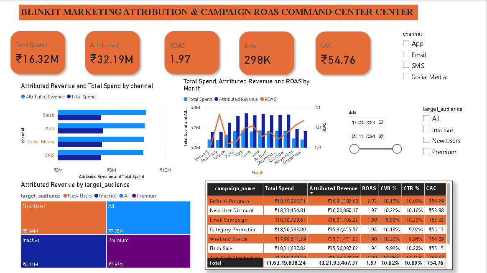

# 📈 Day 8: Blinkit Quick Commerce — Marketing Attribution & Campaign ROAS Analytics



## 📌 Executive Overview
This dashboard analyzes marketing acquisition performance, multi-channel spend efficiency, and campaign Return on Ad Spend (ROAS) across **5,400 campaign records** from March 2023 to November 2024. It provides growth marketers and finance leaders with visibility into customer acquisition cost (CAC), click-through rates (CTR), and bottom-funnel conversion velocity across App, Email, SMS, and Social Media channels.

---

## 🔑 Key Marketing & Growth KPIs
* **Total Marketing Ad Spend:** ₹1.63 Crore (₹16,319,838)
* **Total Attributed Revenue (GMV):** ₹3.22 Crore (₹32,193,407)
* **Blended Portfolio ROAS:** 1.97x (`Attributed Revenue / Ad Spend`)
* **Total Conversions (Orders/Installs):** 298.0K Conversions (298,038)
* **Customer Acquisition Cost (CAC / CPA):** ₹54.76 / Conversion
* **Click-Through Rate (CTR %):** 10.09% (2.97M Clicks / 29.49M Impressions)
* **Conversion Rate (CVR %):** 10.02% (298K Conversions / 2.97M Clicks)

---

## 🛠️ Data Architecture & Modeling
* **Fact Table:** `blinkit_marketing_performance` (5,400 daily records: `campaign_id`, `campaign_name`, `date`, `target_audience`, `channel`, `impressions`, `clicks`, `conversions`, `spend`, `revenue_generated`).
* **Dynamic Ratio Architecture:** Formulated in pure DAX to replace static row-level metrics and protect against unweighted mathematical distortion.

---

## 📐 Core DAX Measures

### 1. Total Ad Spend & Attributed Revenue
```dax
Total Spend = SUM(blinkit_marketing_performance[spend])
```
```dax
Attributed Revenue = SUM(blinkit_marketing_performance[revenue_generated])
```

### 2. Blended Portfolio ROAS (Weighted Ratio)
```dax
ROAS = 
DIVIDE([Attributed Revenue], [Total Spend], 0)
```
* **Engine Concept:** Averages of row-level ratios distort portfolio efficiency. Computing `SUM(Revenue) / SUM(Spend)` dynamically preserves mathematically weighted spend efficiency across all filter contexts.

### 3. Customer Acquisition Cost (CAC)
```dax
CAC = 
DIVIDE([Total Spend], [Total Conversions], 0)
```

### 4. Click-Through Rate (CTR %) & Conversion Rate (CVR %)
```dax
CTR % = 
DIVIDE(
    SUM(blinkit_marketing_performance[clicks]), 
    SUM(blinkit_marketing_performance[impressions]), 
    0
)

CVR % = 
DIVIDE(
    [Total Conversions], 
    SUM(blinkit_marketing_performance[clicks]), 
    0
)
```

---

## 💡 Key Business Findings
1. **Channel Efficiency:** **Email** delivered the highest ROAS (**2.05x**) with the lowest CAC (**₹53.53**), generating **₹81.89 Lakhs** in attributed revenue. **App Notifications** drove high volume (**₹80.75 Lakhs**) with a **1.92x** ROAS.
2. **Top Campaign Drivers:** The **Referral Program** emerged as the top-performing campaign with **2.03x ROAS** and a CAC of **₹54.29**, closely followed by **New User Discount** (**1.97x ROAS**, **₹53.98 CAC**).
3. **Audience Yield:** Marketing to **New Users** achieved the highest revenue yield (**₹81.42 Lakhs**, 1.99x ROAS) at the lowest blended CAC (**₹53.89**), confirming the viability of early customer acquisition funnels.

---

## 📂 Repository Contents
* `blinkit_marketing_performance.csv` — Multi-channel campaign dataset.
* `Blinkit_Marketing_Attribution_ROAS.pbix` — Interactive Power BI workbook.
* `dashboard_preview.png` — Dashboard screenshot preview.
* `README.md` — Project documentation.