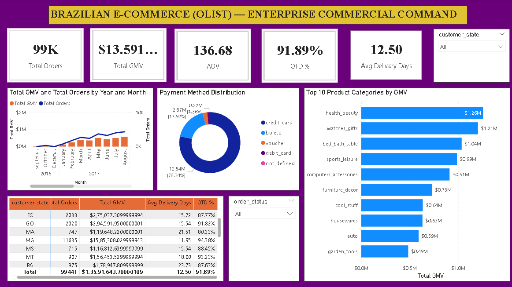

# 🛒 Day 9: Olist Brazilian E-Commerce — Multi-Table Enterprise Relational Data Model & Logistics Command Center



## 📌 Executive Overview
This enterprise analytics dashboard models **99,441 commercial orders** totaling **R$ 13.59M in Gross Merchandise Value (GMV)** from the Olist Brazilian marketplace across 2016–2018. It integrates a 6-table relational Star/Snowflake schema connecting customers, orders, order items, sellers, payments, and translated product categories to evaluate multi-state logistics SLA fulfillment and sales velocity.

---

## 🔑 Key Commercial & Logistics KPIs
* **Total Orders Processed:** 99,441 Orders (96,478 Delivered)
* **Gross Merchandise Value (GMV):** R$ 13.59M (R$ 13,591,643.70)
* **Total Freight Revenue:** R$ 2.25M (16.6% of item GMV)
* **Total Payment Inflow:** R$ 16.01M (R$ 16,008,872.12)
* **Average Order Value (AOV):** R$ 136.68 / Order
* **On-Time Delivery (OTD) SLA Rate:** 91.89% (88,649 orders on time)
* **Average Delivery Lead Time:** 12.50 Days (vs. 23.74 days promised estimated SLA)
* **Marketplace Scale:** 96,096 Unique Customers | 3,095 Active Sellers | 32,951 SKUs

---

## 🛠️ Data Architecture & Star Schema
```
   [olist_customers]                 [olist_products]                 [olist_sellers]
      customer_id (PK)                  product_id (PK)                  seller_id (PK)
          (1)                               (1)                              (1)
           │                                 │                                │
           │ (1:*)                           │ (1:*)                          │ (1:*)
          (*)                               (*)                              (*)
   [olist_orders]   ───────────────>  [olist_order_items]  <─────────────────┘
      order_id (PK)                     order_id (FK)
           │
           │ (1:*)
           ▼
   [olist_order_payments]
      order_id (FK)
```

---

## 📐 Core DAX Measures

### 1. Total Orders & Gross Merchandise Value (GMV)
```dax
Total Orders = DISTINCTCOUNT(olist_orders_dataset[order_id])
```
```dax
Total GMV = SUM(olist_order_items_dataset[price])
```

### 2. Average Order Value (AOV)
```dax
AOV = DIVIDE([Total GMV], [Total Orders], 0)
```

### 3. On-Time Delivery SLA Rate %
```dax
OTD % = 
VAR DeliveredCount = 
    CALCULATE(
        COUNTROWS(olist_orders_dataset), 
        NOT(ISBLANK(olist_orders_dataset[order_delivered_customer_date]))
    )
VAR OnTimeCount = 
    CALCULATE(
        COUNTROWS(olist_orders_dataset), 
        olist_orders_dataset[order_delivered_customer_date] <= olist_orders_dataset[order_estimated_delivery_date]
    )
RETURN 
DIVIDE(OnTimeCount, DeliveredCount, 0)
```

### 4. Average Delivery Duration (Days)
```dax
Avg Delivery Days = 
AVERAGEX(
    FILTER(
        olist_orders_dataset, 
        NOT(ISBLANK(olist_orders_dataset[order_delivered_customer_date]))
    ),
    DATEDIFF(
        olist_orders_dataset[order_purchase_timestamp], 
        olist_orders_dataset[order_delivered_customer_date], 
        DAY
    )
)
```

---

## 💡 Key Business Findings
1. **Geographic Concentration:** **São Paulo (SP)** dominates marketplace demand, generating **R$ 5.20M (38.3% of total GMV)** across 41,375 orders with an average freight of R$ 15.15 and an average delivery time of ~8.3 days.
2. **Logistics Lead Times in Remote States:** Northeastern states like **Alagoas (AL)** and **Amazonas (AM)** experience the longest delivery transit times (**24.5 to 26.4 days**) and lowest OTD rates (**76%–85%**), driven by inter-state shipping bottlenecks.
3. **Payment Preferences:** **Credit Cards** drive **78.3%** of all payment transaction value (R$ 12.54M), followed by **Boleto Bancário (17.9% / R$ 2.87M)**.
4. **Top E-Commerce Categories:** **Health & Beauty** (R$ 1.26M), **Watches & Gifts** (R$ 1.21M), and **Bed, Bath & Table** (R$ 1.04M) form the top revenue pillars.

---

## 📂 Repository Contents
* `olist_*.csv` — Relational raw datasets.
* `Olist_Brazilian_ECommerce_Analytics.pbix` — Interactive Power BI workbook.
* `dashboard_preview.png` — Dashboard screenshot preview.
* `README.md` — Project documentation.

## 📥 Dataset Source
* Dataset: [Brazilian E-Commerce Public Dataset by Olist (Kaggle)](https://www.kaggle.com/datasets/olistbr/brazilian-ecommerce)